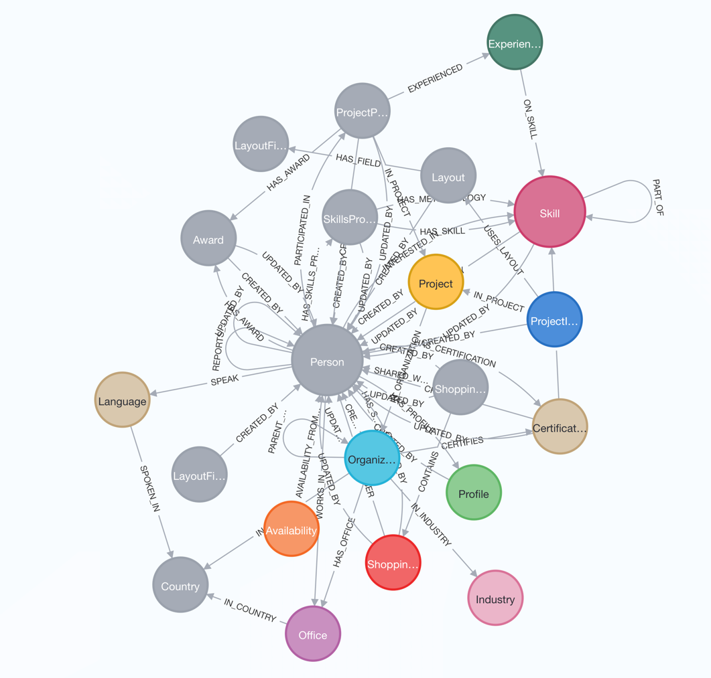

# Hackathon

## Neo4j

| Variable  | Value                     |
|-----------|---------------------------|
| Endpoint | yasm-dev.prodyna.com:7687 |
| Username | neo4j                     |
| Password | ...                       |

| **Note**: Contact Darko Križić for the password.

Example

```
cypher-shell -uneo4j -p... -adev-yasm.prodyna.com:7687
```

### Schema



### Example queries

In which projects did Darko work?

```
neo4j@neo4j> match (p:Person {name:"Darko Križić"})--(pp:ProjectParticipation)--(pr:Project) return pr.name;
+---------------------------------------------------+
| pr.name                                           |
+---------------------------------------------------+
| "Accas Group - Blueception"                       |
| "Media Asset Manager (MAM)"                       |
| "PlaTo 2005"                                      |
| "Heatwave Consumer Finance"                       |
| "MAPIS"                                           |
| "LCCneo"                                          |
| "Construction of an Enterprise Service Bus (ESB)" |
| "Knowledge Hub"                                   |
| "Camino Network"                                  |
| "Accas Group - Blueception"                       |
| "YASM - Skill Management Tool"                    |
| "Knowledge Solution"                              |
| "PAS-X MES SaaS on Azure"                         |
| "New Customer Experience"                         |
| "Knowledge Solution"                              |
| "British Car Auctions - Magnolia CMS Development" |
| "British Car Auctions - Magnolia CMS Development" |
| "DataLake"                                        |
| "Knowledge Solution"                              |
| "Media Asset Manager (MAM)"                       |
| "PlaTo 2005"                                      |
| "Heatwave Consumer Finance"                       |
| "MAPIS"                                           |
| "LCCneo"                                          |
| "New Customer Experience"                         |
| "YASM - Skill Management Tool"                    |
| "Accas Group - Blueception"                       |
| "Media Asset Manager (MAM)"                       |
| "PlaTo 2005"                                      |
| "Heatwave Consumer Finance"                       |
| "MAPIS"                                           |
| "LCCneo"                                          |
| "Construction of an Enterprise Service Bus (ESB)" |
| "Knowledge Hub"                                   |
| "Camino Network"                                  |
| "Accas Group - Blueception"                       |
| "Knowledge Solution"                              |
| "PAS-X MES SaaS on Azure"                         |
| "New Customer Experience"                         |
| "Knowledge Solution"                              |
| "British Car Auctions - Magnolia CMS Development" |
| "British Car Auctions - Magnolia CMS Development" |
| "DataLake"                                        |
+---------------------------------------------------+
```

### At which customers did Darko wor?

```
neo4j@neo4j> match (p:Person {name:"Darko Križić"})--(pp:ProjectParticipation)--(pr:Project)--(o:Organization) return distinct o.name;
+---------------------------------------+
| o.name                                |
+---------------------------------------+
| "CAIRO AG"                            |
| "Samsung Electronics GmbH"            |
| "Deutsche Bank"                       |
| "Markant Services International GmbH" |
| "Lufthansa Cargo AG"                  |
| "Degussa Bank AG"                     |
| "ADAMA Deutschland GmbH"              |
| "Chain4Travel"                        |
| "PRODYNA"                             |
| "BASF SE"                             |
| "Körber Pharma Software GmbH"         |
| "Hapimag AG"                          |
| "British Car Auctions Limited"        |
| "Thomas Cook GmbH"                    |
+---------------------------------------+

```
### In which industries did Darko use which Skill?

```
neo4j@neo4j> match (p:Person {name:"Darko Križić"})--(pp:ProjectParticipation)--(pr:Project)--(o:Organization)--(i:Industry) match (pp)--(e:Experience)--(s:Skill) return s.name,collect(distinct i.name);
+-------------------------------------------------------------------------------------------------------------------------------------------------------------------------------------+
| s.name                                | collect(distinct i.name)                                                                                                                    |
+-------------------------------------------------------------------------------------------------------------------------------------------------------------------------------------+
| "Azure Kubernetes Service (AKS)"      | ["Services", "Media & Entertainment", "IT", "Chemicals & Pharma", "Automotive"]                                                             |
| "Terraform"                           | ["Services", "IT", "Chemicals & Pharma", "Travel and Tourism", "Touristik, Travel & Transportation", "Automotive"]                          |
| "Kubernetes"                          | ["Services", "Media & Entertainment", "IT", "Chemicals & Pharma", "Automotive", "Travel and Tourism", "Touristik, Travel & Transportation"] |
| "Azure"                               | ["Services", "IT", "Chemicals & Pharma", "Automotive"]                                                                                      |
| "Helm"                                | ["Services", "Chemicals & Pharma", "Travel and Tourism", "Touristik, Travel & Transportation"]                                              |
| "Docker"                              | ["Services", "IT", "Chemicals & Pharma", "Automotive"]                                                                                      |
| "OpenTofu"                            | ["Media & Entertainment", "IT"]                                                                                                             |
| "JFrog Artifactory"                   | ["Media & Entertainment"]                                                                                                                   |
| "GitHub Actions"                      | ["Media & Entertainment", "IT"]                                                                                                             |
| "Azure Storage Account"               | ["Media & Entertainment"]                                                                                                                   |
| "Azure Service Bus"                   | ["Media & Entertainment"]                                                                                                                   |
| "Argo CD"                             | ["Media & Entertainment"]                                                                                                                   |
| ".NET (Framework)"                    | ["Media & Entertainment"]                                                                                                                   |
| "Software Architecture"               | ["Media & Entertainment", "IT", "Chemicals & Pharma", "Travel and Tourism", "Touristik, Travel & Transportation"]                           |
| "Dapr"                                | ["Media & Entertainment"]                                                                                                                   |
| "Grafana Loki (Logging)"              | ["Media & Entertainment", "IT"]                                                                                                             |
| "Azure Container Registry"            | ["Media & Entertainment"]                                                                                                                   |
| "Miro (Tool)"                         | ["Media & Entertainment"]                                                                                                                   |
| "GitHub Enterprise"                   | ["Media & Entertainment", "IT"]                                                                                                             |
| "Grafana"                             | ["Media & Entertainment", "IT", "Travel and Tourism", "Touristik, Travel & Transportation"]                                                 |
| "KeyVault"                            | ["Media & Entertainment", "Automotive"]                                                                                                     |
| "Cloud Architecture/Engineering"      | ["Media & Entertainment"]                                                                                                                   |
| "Atlassian Jira"                      | ["Media & Entertainment", "Retail & eCommerce"]                                                                                             |
| "Scrum"                               | ["Media & Entertainment", "Retail & eCommerce", "IT"]                                                                                       |
| "Atlassian Confluence"                | ["Media & Entertainment", "Retail & eCommerce"]                                                                                             |
| "DevOps"                              | ["Media & Entertainment", "Chemicals & Pharma", "Automotive"]                                                                               |
| "JetBrains Rider"                     | ["Media & Entertainment"]                                                                                                                   |
| "Jakarta Messaging (JMS)"             | ["Banking, Finance & Insurance"]                                                                                                            |
| "ReportMill (Tool)"                   | ["Banking, Finance & Insurance"]                                                                                                            |
| "Jakarta Enterprise Beans (EJB)"      | ["Banking, Finance & Insurance"]                                                                                                            |
| "PL/SQL"                              | ["Banking, Finance & Insurance"]                                                                                                            |
| "Microsoft Excel"                     | ["Banking, Finance & Insurance"]                                                                                                            |
| "Oracle (Database)"                   | ["Banking, Finance & Insurance", "Retail & eCommerce"]                                                                                      |
| "Apache Tomcat"                       | ["Banking, Finance & Insurance"]                                                                                                            |
| "Web Services"                        | ["Banking, Finance & Insurance", "Travel and Tourism", "Touristik, Travel & Transportation"]                                                |
| "Service-Oriented Architecture (SOA)" | ["Banking, Finance & Insurance"]                                                                                                            |
| "Jakarta EE (former Java EE)"         | ["Banking, Finance & Insurance", "Retail & eCommerce", "Travel and Tourism", "Touristik, Travel & Transportation"]                          |
| "Java"                                | ["Banking, Finance & Insurance", "Chemicals & Pharma"]                                                                                      |
| "PRODYNA xBeam"                       | ["Banking, Finance & Insurance"]                                                                                                            |
| "IBM WebSphere Liberty"               | ["Retail & eCommerce"]                                                                                                                      |
| "Eclipse RCP"                         | ["Retail & eCommerce"]                                                                                                                      |
| "REST"                                | ["Retail & eCommerce", "Travel and Tourism", "Touristik, Travel & Transportation", "Banking, Finance & Insurance"]                          |
| "Git"                                 | ["Retail & eCommerce"]                                                                                                                      |
| "WildFly (JBoss)"                     | ["Retail & eCommerce"]                                                                                                                      |
| "Eclipse IDE"                         | ["Retail & eCommerce"]                                                                                                                      |
| "IntelliJ"                            | ["Retail & eCommerce"]                                                                                                                      |
| "IBM WebSphere Application Server"    | ["Retail & eCommerce"]                                                                                                                      |
| "JAX-RS"                              | ["Retail & eCommerce"]                                                                                                                      |
| "Enterprise Architect (software)"     | ["Travel and Tourism", "Touristik, Travel & Transportation"]                                                                                |
| "WSDL"                                | ["Travel and Tourism", "Touristik, Travel & Transportation"]                                                                                |
| "SOAP"                                | ["Travel and Tourism", "Touristik, Travel & Transportation", "Banking, Finance & Insurance"]                                                |
| "Enterprise Service Bus (ESB)"        | ["Travel and Tourism", "Touristik, Travel & Transportation"]                                                                                |
| "Enterprise Architecture"             | ["Travel and Tourism", "Touristik, Travel & Transportation"]                                                                                |
| "Talend (ESB)"                        | ["Banking, Finance & Insurance"]                                                                                                            |
| "MuleSoft (API Management)"           | ["Banking, Finance & Insurance"]                                                                                                            |
| "Red Hat Fuse (ESB)"                  | ["Banking, Finance & Insurance"]                                                                                                            |
| "Neo4j"                               | ["Banking, Finance & Insurance", "Chemicals & Pharma", "IT"]                                                                                |
| "Apache Camel"                        | ["Banking, Finance & Insurance"]                                                                                                            |
| "APOC (for neo4j)"                    | ["Chemicals & Pharma"]                                                                                                                      |
| "Liferay DXP"                         | ["Chemicals & Pharma"]                                                                                                                      |
| "AWS (Amazon Web Services)"           | ["Chemicals & Pharma"]                                                                                                                      |
| "AWS CloudFormation"                  | ["Chemicals & Pharma"]                                                                                                                      |
| "Grafana Tempo"                       | ["IT"]                                                                                                                                      |
| "Cloud Architecture"                  | ["IT", "Travel and Tourism", "Touristik, Travel & Transportation"]                                                                          |
| "Gin (Go)"                            | ["IT"]                                                                                                                                      |
| "Infrastructure as Code (IaC)"        | ["IT", "Chemicals & Pharma"]                                                                                                                |
| "OpenTelemetry"                       | ["IT"]                                                                                                                                      |
| "Viper (Go)"                          | ["IT"]                                                                                                                                      |
| "Cobra (Go)"                          | ["IT"]                                                                                                                                      |
| "Continuous Integration"              | ["IT"]                                                                                                                                      |
| "Continuous Delivery"                 | ["IT"]                                                                                                                                      |
| "Integration (Technical)"             | ["IT"]                                                                                                                                      |
| "Cypher (query language)"             | ["IT", "Chemicals & Pharma"]                                                                                                                |
| "Azure DevOps"                        | ["Chemicals & Pharma", "Automotive"]                                                                                                        |
| "Clean Architecture (Principles)"     | ["Chemicals & Pharma"]                                                                                                                      |
| "Microservices"                       | ["Chemicals & Pharma"]                                                                                                                      |
| "Spring Boot"                         | ["Chemicals & Pharma"]                                                                                                                      |
| "Go (Programming Language)"           | ["Chemicals & Pharma"]                                                                                                                      |
| "Pulumi (IaC SKD)"                    | ["Chemicals & Pharma"]                                                                                                                      |
| "Python"                              | ["Travel and Tourism", "Touristik, Travel & Transportation"]                                                                                |
| "Google Kubernetes Engine (GKE)"      | ["Travel and Tourism", "Touristik, Travel & Transportation"]                                                                                |
| "GitLab"                              | ["Travel and Tourism", "Touristik, Travel & Transportation"]                                                                                |
| "Acceleo (MDA)"                       | ["Travel and Tourism", "Touristik, Travel & Transportation"]                                                                                |
| "Keycloak"                            | ["Travel and Tourism", "Touristik, Travel & Transportation"]                                                                                |
| "GitLab CI/CD"                        | ["Travel and Tourism", "Touristik, Travel & Transportation"]                                                                                |
| "Spring Data Neo4j"                   | ["Chemicals & Pharma"]                                                                                                                      |
| "Spring Boot Actuator"                | ["Chemicals & Pharma"]                                                                                                                      |
| "Azure App Center"                    | ["Automotive"]                                                                                                                              |
| "Magnolia CMS"                        | ["Automotive"]                                                                                                                              |
| "Prometheus"                          | ["Travel and Tourism", "Touristik, Travel & Transportation"]                                                                                |
| "Apache Kafka"                        | ["Travel and Tourism", "Touristik, Travel & Transportation"]                                                                                |
| "Amazon EKS"                          | ["Travel and Tourism", "Touristik, Travel & Transportation"]                                                                                |
| "Strimzi (Kafka on K8s)"              | ["Travel and Tourism", "Touristik, Travel & Transportation"]                                                                                |
| "Apache Cassandra"                    | ["Travel and Tourism", "Touristik, Travel & Transportation"]                                                                                |
+-------------------------------------------------------------------------------------------------------------------------------------------------------------------------------------+
```

## Access to YASM API

| Variable      | Value                                                   |
|---------------|---------------------------------------------------------| 
| Endpoint       | https://dev-yasm.prodyna.com/api/graph/v1/              |
| Swagger UI    | https://dev-yasm.prodyna.com/api/graph/v1/swagger-ui/#/ |
| Client ID     | 5d82c15b-1441-46ed-b3cf-98f40326e575                    |
| Client Secret | ...                                                     |
| Tenant ID     | b2748d0a-856e-4184-bda8-831f9ffa8a48                    |

| **Note**: Contact Darko Križić for the Client Secret.

### Authenticate

The shellscript `token` creates a bearer token

```bash
#!/bin/bash

CLIENT_ID="5d82c15b-1441-46ed-b3cf-98f40326e575"
CLIENT_SECRET=""
TENANT_ID="b2748d0a-856e-4184-bda8-831f9ffa8a48"
SCOPE="api://yasm.prodyna.com/.default openid profile"
TOKEN_URL="https://login.microsoftonline.com/${TENANT_ID}/oauth2/v2.0/token"
API_URL="https://dev-yasm.prodyna.com/api/graph/v1/organizations/search"

# Get bearer token
RESPONSE=$(curl -s -X POST "$TOKEN_URL" \
  -H "Content-Type: application/x-www-form-urlencoded" \
  -d "client_id=${CLIENT_ID}" \
  -d "client_secret=${CLIENT_SECRET}" \
  -d "scope=${SCOPE}" \
  -d "grant_type=client_credentials")

TOKEN=$(echo "$RESPONSE" | jq -r '.access_token')
echo $TOKEN
```

```
./token
eyJ0eXAiOiJKV1QiLCJhbGciOiJSUzI1NiIsIng1dCI6InJ0c0ZULWItN0x1WTdEVlllU05LY0lKN1ZuYyIsImtpZCI6InJ0c0ZULWItN0x1WTdEVlllU05LY0lKN1ZuYyJ9.eyJhdWQiOiJhcGk6Ly95YXNtLnByb2R5bmEuY29tIiwiaXNzIjoiaHR0cHM6Ly9zdHMud2luZG93cy5uZXQvYjI3NDhkMGEtODU2ZS00MTg0LWJkYTgtODMxZjlmZmE4YTQ4LyIsImlhdCI6MTc2NTI4OTI3NywibmJmIjoxNzY1Mjg5Mjc3LCJleHAiOjE3NjUyOTMxNzcsImFpbyI6ImsySmdZUGpOL3RTa1lFOGZ1N1hFTzdXZVM3ZnJOdCtwc252YlZXcmlydC96bk05U3BnZ0EiLCJhcHBpZCI6IjVkODJjMTViLTE0NDEtNDZlZC1iM2NmLTk4ZjQwMzI2ZTU3NSIsImFwcGlkYWNyIjoiMSIsImlkcCI6Imh0dHBzOi8vc3RzLndpbmRvd3MubmV0L2IyNzQ4ZDBhLTg1NmUtNDE4NC1iZGE4LTgzMWY5ZmZhOGE0OC8iLCJvaWQiOiI5YzEzOWQ3Mi05NGIxLTQ3NGQtOGVlNi0zZDhjZmI0ZmIwZDQiLCJyaCI6IjEuQVVnQUNvMTBzbTZGaEVHOXFJTWZuX3FLU0cwWWlMRFh6X2hBdDFJMDNaaE9GY2cyQVFCSUFBLiIsInJvbGVzIjpbImFkbWluIiwidXNlciJdLCJzdWIiOiI5YzEzOWQ3Mi05NGIxLTQ3NGQtOGVlNi0zZDhjZmI0ZmIwZDQiLCJ0aWQiOiJiMjc0OGQwYS04NTZlLTQxODQtYmRhOC04MzFmOWZmYThhNDgiLCJ1dGkiOiJ0eHJHLTNkcTdraW0zRGlqWUtnN0FBIiwidmVyIjoiMS4wIiwieG1zX2Z0ZCI6Ik5QUUZ4OEFYNDd6NS1pQTJGUkNvdWRpS3FxVk5jdFVLU0FrRGtZbi1mMndCWlhWeWIzQmxkMlZ6ZEMxa2MyMXoifQ.pxRaqZ2DMK8zfhWHKLhT2hXrFzXULa4vIT5LDgUvDnQWBPnwh6gMUqqSsfjaXBKU2ztIc51qporiJ6Nyc4-UiU3JEHu7yWuTvtkEndBFr89ZFJtcZAygiEpdrXizglAgV_QUBwiarnftW29TnYXX2y7W8F45q0RttQ8ACRbMx2KDULyS4f4F_tO26WiVejuYc8j_vKF_CdO6LztdGzu_JaLAIP4GdQBad-ASOdIRJvwcrdbqmWo7TH96r_f33-hywrhn5XNxkT6Lapd4ISYsgjs72zTt_U9PRE4A2HuD2mwNESE7KtMxUm4MgFxVODeTgazLQs8NqoI9JjQgFHxXvQ
```

which contains the following

```json
{
  "aud": "api://yasm.prodyna.com",
  "iss": "https://sts.windows.net/b2748d0a-856e-4184-bda8-831f9ffa8a48/",
  "iat": 1765289277,
  "nbf": 1765289277,
  "exp": 1765293177,
  "aio": "k2JgYPjN/tSkYE8fu7XEO7WeS7frNt+psnvbVWrirt/znM9SpggA",
  "appid": "5d82c15b-1441-46ed-b3cf-98f40326e575",
  "appidacr": "1",
  "idp": "https://sts.windows.net/b2748d0a-856e-4184-bda8-831f9ffa8a48/",
  "oid": "9c139d72-94b1-474d-8ee6-3d8cfb4fb0d4",
  "rh": "1.AUgACo10sm6FhEG9qIMfn_qKSG0YiLDXz_hAt1I03ZhOFcg2AQBIAA.",
  "roles": [
    "admin",
    "user"
  ],
  "sub": "9c139d72-94b1-474d-8ee6-3d8cfb4fb0d4",
  "tid": "b2748d0a-856e-4184-bda8-831f9ffa8a48",
  "uti": "txrG-3dq7kim3DijYKg7AA",
  "ver": "1.0",
  "xms_ftd": "NPQFx8AX47z5-iA2FRCoudiKqqVNctUKSAkDkYn-f2wBZXVyb3Bld2VzdC1kc21z"
}
```

Note the roles "admin" and "user" which determine the access level.

### Get a list of languages

The shellscript `languages`get a list of languages:

```bash
#!/bin/bash
TOKEN=$(./token)
curl -X POST \
  'https://dev-yasm.prodyna.com/api/graph/v1/languages/search' \
  -H 'accept: application/json' \
  -H "Authorization: Bearer $TOKEN" \
  -H 'Content-Type: application/json' \
  -d '{
  "term": "",
  "skip": 0,
  "limit": 20
}'
```

with this output

```
{
  "objectType": "PagedLanguages",
  "skip": 0,
  "limit": 20,
  "count": 51,
  "directHits": 51,
  "languages": [
    {
      "objectType": "Language",
      "id": "18f35f14-bfdc-43b8-9801-1d5f14027d11",
      "name": "Albanian",
      "code": "sq",
      "nativeName": "Shqip"
    },
    {
      "objectType": "Language",
      "id": "93f43600-d1fb-4715-9336-53fde4c80bfd",
      "name": "Arabic",
      "code": "ar",
      "nativeName": "العربية"
    },
    {
      "objectType": "Language",
      "id": "fc1b316c-2d34-4ffd-b6e3-6da2d0027b62",
      "name": "Armenian",
      "code": "hy",
      "nativeName": "Հայերեն"
    },
    {
      "objectType": "Language",
      "id": "b33fe366-1636-4a83-81b8-b54a4ca4172f",
      "name": "Belarusian",
      "code": "be",
      "nativeName": "Беларуская"
    },
    {
      "objectType": "Language",
      "id": "379ff992-accc-4afb-9517-6c0bdd112a09",
      "name": "Bulgarian",
      "code": "bg",
      "nativeName": "български език"
    },
    {
      "objectType": "Language",
      "id": "900dc624-47f7-415c-8ba9-eba7ddb01dd3",
      "name": "Chinese",
      "code": "zh",
      "nativeName": "中文"
    },
    {
      "objectType": "Language",
      "id": "25790a8d-8bab-4f51-9053-9e186cb98238",
      "name": "Croatian",
      "code": "hr",
      "nativeName": "hrvatski jezik"
    },
    {
      "objectType": "Language",
      "id": "fe000bce-62c1-4b17-9eb9-45ebdf1548be",
      "name": "Czech",
      "code": "cs",
      "nativeName": "čeština"
    },
    {
      "objectType": "Language",
      "id": "860ee198-0e7a-41ba-9ffa-98f9c01464bb",
      "name": "Danish",
      "code": "da",
      "nativeName": "dansk"
    },
    {
      "objectType": "Language",
      "id": "9ae78879-607d-440e-bd79-51fd3fc2a7be",
      "name": "Dutch",
      "code": "nl",
      "nativeName": "Nederlands"
    },
    {
      "objectType": "Language",
      "id": "76aa9017-3e76-4679-98fb-85580936bcbd",
      "name": "English",
      "code": "en",
      "nativeName": "English"
    },
    {
      "objectType": "Language",
      "id": "261c33ae-2851-4cbc-8c77-4dea7ff69919",
      "name": "Estonian",
      "code": "et",
      "nativeName": "eesti"
    },
    {
      "objectType": "Language",
      "id": "067021b9-0028-4ee8-b1d9-eee20f72cc96",
      "name": "Finnish",
      "code": "fi",
      "nativeName": "suomi"
    },
    {
      "objectType": "Language",
      "id": "ff809c2c-5b80-46e4-8f48-9e59fb6029c8",
      "name": "French",
      "code": "fr",
      "nativeName": "Français"
    },
    {
      "objectType": "Language",
      "id": "a015d490-3743-46a3-ba56-ce705c6b519c",
      "name": "Georgian",
      "code": "ka",
      "nativeName": "ქართული"
    },
    {
      "objectType": "Language",
      "id": "8d92b498-32e3-4b90-a546-8dad43a87048",
      "name": "German",
      "code": "de",
      "nativeName": "Deutsch"
    },
    {
      "objectType": "Language",
      "id": "805a2726-3191-4698-b7df-85f1e7bf8589",
      "name": "Greek",
      "code": "el",
      "nativeName": "ελληνικά"
    },
    {
      "objectType": "Language",
      "id": "c4004247-8d52-4df1-a929-e9090cbff0a6",
      "name": "Hebrew",
      "code": "he",
      "nativeName": "עברית"
    },
    {
      "objectType": "Language",
      "id": "cca516f3-9503-4204-9e72-dfe9f387e30d",
      "name": "Hindi",
      "code": "hi",
      "nativeName": "हिन्दी"
    },
    {
      "objectType": "Language",
      "id": "0498a259-0f5a-4bd9-ae2b-21e8afcad025",
      "name": "Hungarian",
      "code": "hu",
      "nativeName": "magyar"
    }
  ]
}
```

### Get organizations

This script gets the first 5 organizations

```
#!/bin/bash
TOKEN=$(./token)
curl -X POST \
  'https://dev-yasm.prodyna.com/api/graph/v1/organizations/search' \
  -H 'accept: application/json' \
  -H "Authorization: Bearer $TOKEN" \
  -H 'Content-Type: application/json' \
  -d '{
  "term": "",
  "skip": 0,
  "limit": 5
}'
```

with the output

```
{
  "objectType": "PagedOrganizations",
  "skip": 0,
  "limit": 5,
  "count": 1741,
  "directHits": 1741,
  "organizations": [
    {
      "audit": {
        "created": null,
        "createdBy": null,
        "createdById": null,
        "updated": null,
        "updatedBy": null,
        "updatedById": null
      },
      "organization": {
        "objectType": "Organization",
        "id": "efbcb066-7676-4ef8-96a9-c983add22708",
        "name": "1&1 AG",
        "synonyms": [],
        "location": "Elgendorfer Str. 57 56410 Montabaur",
        "geolocation": null,
        "description": null,
        "partner": false,
        "customer": true,
        "picture": "data:image/png;base64,iVBORw0KGgoAAAANSUhEUgAAAgAAAAIACAIAAAB7GkOtAAAAGXRFWHRTb2Z0d2FyZQBBZG9iZSBJbWFnZVJlYWR5ccllPAAAA3ZpVFh0WE1MOmNvbS5hZG9iZS54bXAAAAAAADw/eHBhY2tldCBiZWdpbj0i77u/IiBpZD0iVzVNME1wQ2VoaUh6cmVTek5UY3prYzlkIj8+IDx4OnhtcG1ldGEgeG1sbnM6eD0iYWRvYmU6bnM6bWV0YS8iIHg6eG1wdGs9IkFkb2JlIFhNUCBDb3JlIDUuNi1jMTExIDc5LjE1ODMyNSwgMjAxNS8wOS8xMC0wMToxMDoyMCAgICAgICAgIj4gPHJkZjpSREYgeG1sbnM6cmRmPSJodHRwOi8vd3d3LnczLm9yZy8xOTk5LzAyLzIyLXJkZi1zeW50YXgtbnMjIj4gPHJkZjpEZXNjcmlwdGlvbiByZGY6YWJvdXQ9IiIgeG1sbnM6eG1wTU09Imh0dHA6Ly9ucy5hZG9iZS5jb20veGFwLzEuMC9tbS8iIHhtbG5zOnN0UmVmPSJodHRwOi8vbnMuYWRvYmUuY29tL3hhcC8xLjAvc1R5cGUvUmVzb3VyY2VSZWYjIiB4bWxuczp4bXA9Imh0dHA6Ly9ucy5hZG9iZS5jb20veGFwLzEuMC8iIHhtcE1NOk9yaWdpbmFsRG9jdW1lbnRJRD0ieG1wLmRpZDphZGE0MWUzOC1hYWZmLTM0NGYtYThiMS1lNTY4N2UyNjcyZjIiIHhtcE1NOkRvY3VtZW50SUQ9InhtcC5kaWQ6NTYzNTI2QjMyN0NGMTFFNkI5NjRGRUZFRUJFRjM4NjQiIHhtcE1NOkluc3RhbmNlSUQ9InhtcC5paWQ6NTYzNTI2QjIyN0NGMTFFNkI5NjRGRUZFRUJFRjM4NjQiIHhtcDpDcmVhdG9yVG9vbD0iQWRvYmUgUGhvdG9zaG9wIENDIDIwMTUgKFdpbmRvd3MpIj4gPHhtcE1NOkRlcml2ZWRGcm9tIHN0UmVmOmluc3RhbmNlSUQ9InhtcC5paWQ6MjY3MTA4ZGMtM2FlZC0yYTRjLWJjYmItMjQ5NTdmOGI5NjI1IiBzdFJlZjpkb2N1bWVudElEPSJ4bXAuZGlkOmFkYTQxZTM4LWFhZmYtMzQ0Zi1hOGIxLWU1Njg3ZTI2NzJmMiIvPiA8L3JkZjpEZXNjcmlwdGlvbj4gPC9yZGY6UkRGPiA8L3g6eG1wbWV0YT4gPD94cGFja2V0IGVuZD0iciI/PgeWLnMAABhQSURBVHja7N0JfBX1gcBxQk4CgYQbkyC34IUiioAIgoiCVtFar+oWj3qfW1DQgidda+u1eCBYu612tYiKZVGRyxOKKKCoXILch0AIgZA7+3bZj9uP9cA3k+SR9/1+8unHwpv/mzczvF/mzbyZhCb9/r0OAPGnrkUAIAAACAAAAgCAAAAgAAAIAAACAIAAACAAAAgAAAIAgAAAIAAACAAAAgCAAAAgAAAIAAACAIAAACAAAAgAAAIAIAAACAAAAgCAAAAgAAAIAAACAIAAACAAAAgAAAIAgAAAIAAACAAAAgCAAAAgAAAIAAACAIAAACAAAAgAAAIAIAAACAAAAgCAAAAgAAAIAAACAIAAACAAAAgAAAIAgAAAIAAACAAAAgCAAAAgAAAIAAACAIAAACAAAAgAAAIAgAAACAAAAgCAAAAgAAAIAAACAIAAACAAAAgAAAIAgAAAIAAACAAAAgCAAAAgAAAIAAACAIAAACAAAAgAAAIAgAAACAAAAgCAAAAgAAAIAAACAIAAACAAAAgAAAIAgAAAIAAACAAAAgCAAAAgAAAIAAACAIAAACAAAAgAAAIAgAAAIAAAAgCAAAAgAADUVkkWQXXaNvs6CwG+R9OTxlkI9gAAEAAABACAsDgGUGNmzl87a/4ay4E41za70eVDj7QcBCC+fPjZ5vGTF1sOxLleXbMFoKb4CAhAAAAQAAAEAAABAEAAABAAAAQAAAEAQAAAEAAABAAAAQBAAAAQAAAEAAABAEAAABAAAAQAAAEAQAAAEAAABABAAAAQAAAEAAABAEAAABAAAAQAAAEAQAAAEAAABAAAAQBAAAAQAAAEAAABAEAAABAAAAQAAAEAQAAAEAAABABAACwCAAEAQAAAEAAABAAAAQBAAAAQAAAEAAABAEAAABAAAAQAAAEAoJokWQTUVk0y6x3VqdnhHZq1bpmR06JhTosG6WnJGekpKcl1ExISikrKdheW5hcUr9m0a83mXSvW7Fjw2ZZlX+6oqKy06BAADhgXnNolt2VGzc7DH19dsnVHYY0vigbpKSd2yxl4fJt+3XNzW3zfMqmXmpSVkRZ5zOEdmn79h7sLS97+aP3Ud754c+6avIKiGnwhQ/t37Ng6q2YX5vOvL127eZd/XwJAjAegc6+u2TU7D9PeXVWDAUhIqNP7qJyfD+5yxokdUlMSg/Rj8AntIj+lZRV/e2vlUy99vOCzzTXyis7u3+m03m1rdp2+t2iDAAgAxK66CQlnntRh+CXHdTo4zN+Xk5Pqnj2gU+Rn3ieb7h7//vxPN1nUCADEkJO6t77vuj7hvvV/w/FHtJo27pxX31p526Nvx8JnXCAAxLtmWeljr+sztH/H6nm6n/TtcMLROcMfmjNlzkoLn9qzA20RcMDp1TV7zoTzqu3df5/GDdOeHnPq3Vf3TqybYBUgAFADrjyn68sPntWiSf0aefZrfnb0n+8dUi/VrjMCANVr9C973Xddn5r9HfyUnm0iuwIpSYlWBwIA1WTkpT1uuKBbLMxJpAFPjT4lwUdBCABUg4uHHPqvFx8bO/Nzep/2MTU/IADUTscd1uqBm/vF2lyN+MVxfY7OsXYQAKgq9eslPz7q5KTEmNtW6yYkPDy8f5oDwggAVJE7Lu/Z5qBGsTlvB7dqOPwSHwQhAFAF2uVkXnrWEbE8h1ee07VJozRrCgGAkN1+2fEx/sWrtNSka8/rZk0hABCm7OYNzujbPvbnc9iZhwe5BCnUFMeviF0XDzmsbqgn26/bUrBmY/62/KLIoFkN0zq2zmrVNIRvFGekpwzu3e7l2SusMgQAwnHuwENCGWfbzr1PTV784ozl/3x1+9YtG57ep92VPz0qsrcR5CnOObmTAHDA8REQMapDbtbBrRoGH+dPUz/tftGfH3x2wbfe2yTyh49PWnTcxX9+8sXFQZ7lxG45MXiiKggAB6R+3XODD3LPhLm3/H727sKS739YcUn5HY+9c9ujb0f9ROlpyUcd0txa48DiI6Da4IKRU6P79bPHEa3+Mvb02HxRR3ZsFnCEP7665JG/fLj/j5/48sfHdGkR9edOkWlDvH/klfdOT06KZp12addk6iNn+0eBAMSLPXtLq3nCanBIm8ZBJv8qr/DO8e//2Kkik5zZr0NKcjSn9LTPzQzx5RcWRblqfnB3B77mIyBiVNvsQN/+febVJVG8FW7Zvuf191dH94wdW2dZawgAhKBRg9Qgk097d1V0E767cEN0EzZu6PvACAAElpaaFOQLwGXlFUtX74hu2m89WWh/ZNRPseIQAAgqNTnQF2v37C2NNCC6aXcWFEc3Yf20ZCsOAYCgAh7JTAjw/eEG6VG+j5dGmxwQAPh/5RWVFZWVQd7Eo/4EqUmjelEGoEwAEAAIQ15+UfSbdUJCbssov0Uc9fe5du4qstYQAAjB2s0FQSbv1qVFdBP26npQdBNuy99rrSEAEIJVG3YGmXxQzzZRTNU+J7Nrpyj3ANYFKxYIAPyf5Wvygkw+5IR2UZyYf/GQQ6N+xpXrdlprCACEYN4nG4NMnpaa9GPvJdmiSf0gt59cvHyrtYYAQAg+WLK5INjJoNedd3SzrPT9f/zIS3ukR3suf3lF5aJlAoAAQBhKysrfiPayPPs0SE/59RU99/PBJxyd8/PB0X/+M3/Jpli+sh4IAAeY56Z9HnCEC0/rclL31j/4sOaN08ffPjDIE70x90vrCwGA0Ly7aP3nq7cHHOTh4f0z0r/vKj1pqUl/umdwiybR3xy4orJy8oxl1hcCAKGprKwz7vmFAQfJbt7gd7f0+66/TUlKfHr0oO6HtgzyFLPmr920bY/1hQBAmCa9uSzg+aAR5wzodN4pnb/13f+Zu04d1KttwPGfmLTImkIAIGQVlZV3jn8v+DgP3Nz3GzdsaVg/5fn7zwj+7v/R0i1vfbjOmkIAIHzT5345c/7agIOkpyU/c9dpX5/l2S4nc9q4n57YLSf47N314288CQIA++tXD86O+h65X+vcpvHv//dgwOAT2s0c/7POwe45vM9/vbPqvUUbrCAOUG4KzwFg3ZaC+ybOu++6PgHHOXfgIU0y6/U/tnUoc7W7sOS2R9+ydrAHAFVrwksff7R0S/Bxwnr3j7jjsXed/IMAQJWrqKy8ZuyMvcVlMTI/U+asfHbaZ9YLAgDVYeW6vFH//naMzMktv59tjSAAUH3+/F+f/e3tL2p2HnYXllx8x7T83cVWBwIA1eqW382uwU/eS8sqho15fcXaPCsCAYDqlldQdMU9b5RXVNbIs9/0wKzZC9ZaCwgA1Ix5H2+8Z8Lc6n/eEQ+/9cL0pZY/AgA16bEXPnrtvdXV+YyR5PxhyieWPAIANayyss71989Ys2lX9TzdmCffe+QvH1rsCADEhJ0FxcPGvFZSVl7VTzT84TmPvbDQAqf2cSkIDlQtm9S//oJuKUmJVfcUpWUV1/7bjJdmLre0EQCICYl1E644+8jbhvVo8L23+gpod2HJL8a8NmeBSz0jABAb2uVkPjFq4DFdWlTps2z8aveFo6YuWbnNAkcAoOYlJNT55dldf31Fz7TUqt1uP17x1YUjp27e7kJvCADEgMyM1MdHDjylZ5tqeK5xLyz07k88cBYQB4BunVvMeuq86nn3j/jtjX1zmmdY7NgDgBp29oBO424dkJKcWG3PGNnbmDB60Bk3vlRWXhH1IPXrJTdpVC+6abfs2FNcUm7VIwDEr4SEOiN+0WP4JcdW/1Mfe1jLkZf2CHLBidN6t3vy9oHRTXv+bX+b8fc1NgCqmo+AiFGJdRMe/Nf+NfLuv88NFxxzUvfobx+2s6Ao6mmrc3cHAYDYkpKU+MSogRcPObRm9z8eH3Vy88bp0U2+a3dJ1E+dKgAIAHH7u/+E0YPOHtCpxuekWVb64yMH1o2kIIo9gN3R7wFU9XmuIADEosib7SMjBgzp0y5G5qdf99wbLuwWxYT5QfYAUuwBIADEn7uvPuH8QZ1japZGXnr8cYe1+tF7AAGOAaQJAAJAvPn54EOvPveoWJurfR9JZWak/qipikvKoz6Vs2H9VBsDAkAc6XF4qwdu7heb85bdvMGjIwb82KmKS6M9lz/B5oAAEDeyMtImjjk1OSn8DbK8onLV+p3Bxxl8QrvLhx5pTSEAELKHh/dv1bR+6MOuXJd36rWTTr/xpS1hXNvn7qt7H96haTUsjbKyCpsEAkBcOHfgIVVx2s+z0z7r/8u/Lly6deuOwivumV5RWRlwwJTkxKfHnFq/XvJ+Pj4pMcqPcgqLSm0VCAC1X2ZG6r3XnBDumMUl5df+ZsZND8z6+p30/cUb7n9mfvCR2+dk/m6/D1SkpyVbvwgAfKfbL+vZJLNeiANu2rZn8PWTX5i+9Bt//tCzC0K5vVdkf2V/TlStF+DLXNEfPQYB4EDRNrvRJWccFuKAn67aPuiaSYuXb/3nv6qorLzqvumhHAz47U19O7bO+sE9m6jHD3IZCRAADgwjh/VIrBvaOY8fLd1yxg2TN361+7sesG3n3lAOBqSnJU8cPej7v6/bLCs96vHzdhXZNhAAarODWzU8q3/HEN/9f/qrKbv2/MDvzmEdDDisfdN7vvfQRdMAn2vlFQgAAkCtdtnQI6O7zto/W74m72cjXv3Bd/99wjoYcOmZR5zep/13/W1Oi+jvKbYjXwAQAGqvlOTEi07rEspQ2/OLzr/tbzsLivfz8fsOBmzaFsLBgEdG9M/9jjf6yP5NkFdkC0EAqLVOOrZ1owYhXPGmsrLOVfdOX7t514+a6n8OBtz9enlF0IMBkZcwYfSgpMRv+XfUNrtRdGMWFJbsLnQQGAGg9jqrX4dQxnnixUWzF6yNYsJ5n2wa+/S84DPQ/dCWoy47/p//vEvbJtENuHpDvs0DAaDWSkio0/+4g4OPs25LwW8CvIk/+p8fzpy/NvhsXH9+t2/cPDItNal9bmZ0o30RxpWLQACIUR1ys5o0Sgs+zn0T5+0tLot68srKOteMDeFgQKRnT9w+8B9vHnlUp2ZRH99eJQAIALVYj8NbBR9k9Yb8l2YuDzjI9vyiUA4GNM2s98So/7955AlH50Q9lD0ABIDa7JA2jYMP8syUT4J/patOeAcD+h6Te9NFx+z771N6tol6nI+Xf2ULQQCotTpE+/n4P3p59oqw5iesgwG3Dutx/BGtOh2c1a1zi+hGKCwqXbE2zxaCAFBrtWgS9NL/n6/eHsqJ/PvsOxiwYevugOMk1k0Yf8egsdedGGR3JPjnUSAAxK7g3wBYtGxruLO0Pb/o8rtfLysPeieW7OYN+nXPjXry9xZtsHkgANRmQa6Uuc/aTbtCn6sPPt18z4S5NbtkZs5fY/NAAKjNdhcGveNVQdV8V/bxvy6cPvfLmlos67cWLFm5zeaBAFCbBT97J6yryH1DZL6u/c2M4AcDojNl9krbBgJALRf8eveNG9WrqnkrCOdgQBQmzVhm20AAqOW+ytsbcIQg19r8QTVyMGDRsq0+/0EAqP3Wbwl6CPeIjk2rdA6r/2DA0698YsNAAKj9vlgf9IKXHXKzsps3qLo53HcwYP3WgupZIBu27p48Y7kNAwGg9lu+ZkfwQc44sX2VzmReQdGlY14vLauOgwFPTFpYUlZuw0AAqP0+XhHC5W4uO+vIKjoX6GsfLd1y1/j3qnpprN286w+vLLFVIADEha07CtdtCfrpStvsRucOPKSqZ3X85MXT3l1VpU9xz4S5fv1HAIgj7y8O4ZoHY67slZWRVqXzWVlZ54bfzvyxt5zcf29/tP7lWStsDwgAcWT2B+uCD9K8cfqjtw6o4s+B6uwsKL78rjeq4mBAUXHZrx6aY2NAAIgvM/++JpQvW53Wu+291/ap6rldv7WgKnYC7nrqfff/QgCIO3kFRW99uD6Uoa48p+u/3XBiYt2q2hHoeeRBs586r31OZrjDzpy/duLLH9sSEADi0QvTl4Y11OVDj3zh/p+0DHybgW9ITUm888peUx4e2iLskbfnF10zdnqlK/8jAMSnqW9/sX3n3rBG69c9951nLhh25uFJieFs1UP6tJv7Hxddd363qjjZNKth6mHtm9oGEADiVElp+R9eDfP896yMtAdu6vf+Hy+MZKBealJ0gyQn1T2rX4fZT533H3cPbt2yqq44FInK+DtOad443WaAABCnJr60uLCoNNwx2+VkRjKw7JXLJvx60ND+HffzTTYSjL7H5N5/Y98lk4ZNHHPqER2bVfVrb5aVHpnDqjt0AT8oySKgBm3PL3rsr4uGX3Js6COnpyVH3v0jP5H/Xrel4PNV21dvzN+8bc+2nXuLS8uLissaNUiNvOk3zazXNrtRh9yswzs0jfzuX80vv/dR2bcO6zH26Xm2BASAeDTu+Y8uHnJo6Mdv/1Fui4zIT2y+/Jsv6j538cbZC9baEqh+PgKihu3ZW3r7uHfi9uUnJNR58vaBVdo/EABi15Q5K1+ZE793Q2ySWW/C6EFhnbwEAsABZviDc6rt4vsxqOeRB4267HibAQJAPMorKBo25rWS0vi9KOYNF3Q7ucfBtgQEgHi0cOnWq8e+Gc9L4PFRAw9q1sCWgAAQj6bMWTn84Tlx+/IbN0ybMHpQ9Z+NigBATHhmypIRD78Vty+/x+Gtfn1FT5sBAkCc+sOUT666783quRlvDLrmZ0cP6tXWZoAAEKdenLFs6C0vbwvvUnHVoLik/L6J8/bsDeHKFo/ddnJO8wybAQJAnJr3yaZ+lz8fyp0jq8GyNTsGXPnCQ88tuOl3s4KPlpmROnGMgwEIAHFs8/Y9Z938yh2PvVNUXBbL8/nca58NvGrS0i93RP775Vkr/jT10+Bjdj+05Z1X9bYNIADEr4rKyidfXNzzX56b+s4XMTh7m7btuWDk1Bt/O+sfr2k6atw7n6/eHnzwK8/pOqRPO9sAAkBcW7el4BejXxty/eTY+USotKxi3PMfRcr05rwvv/FXkf2VS+98PZTLXD86YsDBrRraABAA4t3fl2z6yU0vRzIw7d1VFTV3N8Xyisq/Tl92/CXP3jn+/d2FJd/6mBVr82595O3gz9WoQerE0aemJCVa+1QFl4PmwMtA5Ce3RcZPTz7knJM7dW7TuNqees/e0uffWPrki4tWb8j/wQf/5+uf9z4q+/xBnQM+6dGdm999Te/bHn3bqkcACNPGr3aPn7w4lKG2V+8pm+u2FDz03ILIz6Htmpx1Use+x+RG3iir4ua9EWXlFXM/3jjpzWWvvvXFd/3K/61GPPzWmo35CWHc8ysrIy2voGg/V0RY6zSyefg3IgDUWpHfZA/0a/F/tmp75Gfs0/Ma1k/p2TW7d9eDDmvfNPLTNLNekGFLyspXrMlb8NnmdxdumPXB2vzdxVEMUlhU+sCfPqjmBbJp2554vr8CAkA82rWn5I33V0d+9v3fSAC6tG2S3bxBy6b1s5tlRP63UYOU9LTk5KS6DRuk7ntMeXnFvu9t7dhVtC1v75YdhV/lFa7dtCtSlC/W74z84m+pIgBw4Nm2c+87C9dbDvA9nAUEIAAACAAAAgCAAAAgAAAIAAACAIAAACAAAAgAAAIAgAAAIAAACAAAAgCAAAAgAAAIAAACAIAAACAAAAgAAAIAIAAACAAAAgCAAAAgAAAIAAACAIAAACAAAAgAAAIAgAAAIAAACAAAAgCAAAAgAAAIAAACAIAAACAAAAgAAAIAIAAWAYAAACAAAAgAAAIAgAAAIAAACAAAAgCAAAAgAAAIAAACAIAAACAAAAgAAAIAgAAAIAAACAAAAgCAAADwDUkWQU3JbZnRq2u25UCcO6JDUwtBAOLOBad2ifxYDkBN8REQgAAAIAAA1HqOAVSrpieNsxAAewAACAAAAgCAAAAgAAAIAAACAIAAACAAAAgAAAIAgAAAIAAAAgCAAAAgAAAIAAACAIAAACAAAAgAAAIAgAAAIAAACAAAAgCAAAAgAAAIAAACAIAAACAAAAgAAAIAgAAAIAAAAgCAAAAgAAAIAAACAIAAACAAAAgAAAIAgAAAIAAACAAAAgCAAAAgAAAIAAACAIAAACAAAAgAAAIAgAAAIAAACACAAAAgAAAIAAACAIAAACAAAAgAAAIAgAAAIAAACAAAAgCAAAAgAAAIAAACAIAAACAAAAgAAAIAgAAAIAAACACAAAAgAAAIAAACAIAAACAAAAgAAAIAgAAAIAAACAAAAgCAAAAgAAAIAAACAIAAACAAAAgAAAIAgAAAIAAACAAAAgAgAAAIAAACAIAAACAAAAgAAAIAgAAAIAAACAAAAgCAAAAgAAAIAABV678FGACkDWrEnK7dQAAAAABJRU5ErkJggg=="
      },
      "serviceManager": null,
      "children": [],
      "parents": [],
      "projects": [
        {
          "objectType": "Project",
          "id": "5dadb6ba-bb96-42a2-a2f5-b1cbe0eda2bc",
          "name": "Quality Management and Knowledge Discovery",
          "synonyms": [],
          "location": null,
          "geolocation": null,
          "description": "1&1 is one of Germany's leading telecommunications providers with around 15 million customer contracts. Many external call centers with thousands of agents handle incoming contact requests for 1&1.\n\nThe aim was to ensure that the qualitative specifications for communication and technical information are implemented correctly so that customer service achieves the highest level of satisfaction among callers.\n\nFor this purpose, the recorded conversations and written communication were listened to and read and checked for compliance with the specifications. The results were recorded and evaluated in 1&1's own software solution. The derived measures such as training and side-by-sides were then implemented by the service providers.\n\nApproximately 1,000 - 1,500 customer contacts were checked and documented every month in various specialist areas and topics. Later in the project, customer surveys and knowledge discovery were also carried out in order to place the quality measures even more efficiently and to further increase customer satisfaction.\n\nAnother goal was to analyze financial savings potential. Using the Knowledge Discovery method, thousands of data sets were analyzed for causal relationships. The results ranged from optimization approaches at the training level to measures to shorten consultation times and follow-up times. Overall, savings potential in the millions was identified.",
          "external": false,
          "erpIds": [],
          "projectType": "UNKNOWN_TYPE",
          "confidentiality": "UNKNOWN_CONFIDENTIALITY"
        }
      ],
      "industries": [
        {
          "objectType": "Industry",
          "id": "811b00fb-6f4a-44cc-ba9c-fae0eed5a0f7",
          "name": "Telecommunication",
          "synonyms": [
            "Telecommunications",
            "Telco"
          ]
        }
      ],
      "certifications": [],
      "offices": []
    },
    {
      "audit": {
        "created": "2025-11-04T15:40:18.225Z",
        "createdBy": "Julia Fuchs",
        "createdById": "8af53dd7-e0c8-4ccc-a140-c766084cff19",
        "updated": "2025-11-04T15:40:18.283Z",
        "updatedBy": "Julia Fuchs",
        "updatedById": "8af53dd7-e0c8-4ccc-a140-c766084cff19"
      },
      "organization": {
        "objectType": "Organization",
        "id": "f718d40d-5023-4d00-94c9-d2c12bfd45c1",
        "name": "1994 Ltd",
        "synonyms": [],
        "location": "1994 Limited Mountbatten House, 1 Grosvenor Square, Southampton SO15 2JU, United Kingdom",
        "geolocation": null,
        "description": "1994 Ltd is a UK-based digital solutions company specializing in bespoke web and mobile application development, e-commerce platforms, and tailored software solutions. Founded with the mission to empower brand visionaries, the company focuses on creating custom-built and strategically optimized digital products that help businesses scale and operate efficiently. Operating since 2012, 1994 Ltd combines technical expertise with a client-centric approach, delivering solutions that align with individual business needs and goals. Its services include web applications, mobile applications, e-commerce development, and ongoing support and maintenance. The company works across diverse industries, from luxury brands and travel to defense and fitness, ensuring adaptability and innovation in every project.",
        "partner": false,
        "customer": false,
        "picture": "data:image/jpeg;base64,/9j/4AAQSkZJRgABAQAAAQABAAD/2wBDAAMCAgMCAgMDAwMEAwMEBQgFBQQEBQoHBwYIDAoMDAsKCwsNDhIQDQ4RDgsLEBYQERMUFRUVDA8XGBYUGBIUFRT/2wBDAQMEBAUEBQkFBQkUDQsNFBQUFBQUFBQUFBQUFBQUFBQUFBQUFBQUFBQUFBQUFBQUFBQUFBQUFBQUFBQUFBQUFBT/wgARCADIAMgDASIAAhEBAxEB/8QAHQABAAMAAwEBAQAAAAAAAAAAAAYHCAMEBQkCAf/EABYBAQEBAAAAAAAAAAAAAAAAAAABAv/aAAwDAQACEAMQAAAB1SAAAAAAAAAAAAAAAAA/FcFlKeuEAAAAAAAAAAZ00Xi+Il4OjaNLU1ZlfVAILU6ZS8WNjs339XpAAAAAAAAYH3xgSLX1Jl/UBW2M7J8s/Eu1l+z55yXTeMD6K81WWnQAAAAAADAW8ariB6cruxDD8hmWdj6LM7ywm+CbDr01jdMRl1AAAAAAKasTBkdnz7p0YYKsq+MlG9c7cepj568P0Qy+UJadabpJUKAAAAAAp7Iu2sSxv33qUuumSNUYejm3VivZhCMTSyIGhtKwuaAUAAAAAAyJrv8Ah85pdpuARRHl/ucF4R62sQnCsCv43PNIXNNAAAAAAAAGUbixjHNt+pu6VB40d2IcuNtrYpNzzSFzSgAAAAAAHT7lbGUu5Yd3x2cParr8pCxpSIHBbZqYn/e9P1i1LRr6waAAAAAAAAAArrFO681xpCaRuSUAAAAAAAAAAAAAAAAAAAAAAAAAAAAAB//EACwQAAEDBAAEBAYDAAAAAAAAAAUDBAYAAQIHFzA2QBASEzURFRYhMWAUJCX/2gAIAQEAAQUC/U8s7J4ldhBxdROcLSc12sl2Y5ZviZ0gYyrU3vvav40TNyIVqWjbVNkY1L7z4SGZD45T7a5JbLHZZ3HIVtnLzjyTYq17CSfeRakt/rVOZR9ODVVc11AkNKHsF9VF0k3rFwNcRWSrRsiitg4R58h9/wBR+5VsZ/k8lMKCYHj+GGKeFT4AmYB1rZ9d5F+ee+5zUVv71TlG6Mr1g9waSXwkr3AeBrVCd8Y7znTxBimsThnqgnMaRXragDLK6amSKgPaqfor7QCpJyuZOZPnUTF3Dx/mzWeWB3ev3BFfwjU6fgVGjtoeGyTWLhuo5HOmWWLRfNOtex75ya5sgK2Chlls3C0IgljiaEZEtkz+uRxRF40VYOtVmsm5Lw2bJ/5ThBDNytGQWEeEc3aal8IzQFHBAJ4bUQwSkkPzunKKmkktHBOWV88tXRvz586eDcicYrXksRfD6fP241tJzd5AZ18yu8lS66bVCUH1JGWqF9Lc+cQpQM4/FN5cZa4PibsnnWrgV2Q7Z8n+N/CGdLc+9rZWKa4DksyGsx4lpl8PND43lJCsoOpRYKstm4VGR31I1UM6W7HZUn+YvUUc3K0ZBpRcLMZHlIywAMqeKTVmkPglQzpbsJ3Jvp8V+a1hGK2dJ/QSrXsa+SC9hdH1DOlue8dpMGshNqyArFY/nIyx0s3ioN06VeuUFbt1uI5+iU2LlmVMZ0ZHNOI5+tfHHh4VzZoAISNvwlI1EYzhGRswh5KTvuEj+uEj+uEj+jeu3YMXQrWrwsO4SP6hccWjI7tNhdH1DOlu2lwxcxHuGRyo4xVGg/1P/8QAFBEBAAAAAAAAAAAAAAAAAAAAcP/aAAgBAwEBPwEp/8QAFBEBAAAAAAAAAAAAAAAAAAAAcP/aAAgBAgEBPwEp/8QARRAAAgEBAwYFEAoBBQAAAAAAAQIDBAAREgUQISJBURMxQGHBFBUjMDI0QlJicXOBkaGy0SRDU3J0gpOiseFgM4OSwtL/2gAIAQEABj8C/wATLMQqjjJsVE/Vco8Cn1vfxWmp+pkp6dIS403tfeBx+vk1TRUVMiGFzGZZNbi3C19ZVyTeSTq+zizVX4Y/EvJspGlpJHQ1UnZDqr3R2mwbKNZ/t0//AKPytXU8WiKKd0W/cDas/D/9hnwTOZanZBH3Xr3WPU0EFMnPrta8zxtzGIWC5RpBh+0p9nqNlqKSVZom2ryHKn4qX4jat9D05gIburJ9WPyd7WaSRi8jG8sx0m3CU8GCD7WU4V/u2JJKWY+KrkH3izQVMTQyrxqwssqktTtomi8YfOySxtijcYlYbRyDKX4mT4jav9EP5zVCX6kAES+y8+82hgl0wIOFkG8DZ7brBVAVQLgBszTS4fpNMpkRttw4xmiVjeYHaLp6eQZR/ESfEbZQ9Gv85sog7Xxe0A2wObuHiaNfPoPRnrppDcBEwHOToGadj4VS13/Fe38JUTxwJ40jYRZzJ1C7sb2bgcV5891nbJk1LFLLoKq+En1HNFlWJb1A4Oa7ZuPR7LK6MUdTeGGw2WPKkL8INHDwjj84tehnmbxVju/mwQrwFIhvWEG/TvOajpmF0gXE/wB46T240dFhkrrtZjxRf3YzVUzzyHwnN+dUd2qqPbC54vunZZZY8M9LOvEfeDZpsldnhOngCddfNvthqKaWFt0iEWaRYZCi6SwXQMyzSLfS0tztztsHbqqs2xpqje3EPfZ5ZGLyOcTMdpt1dXFlo77kRdBk/q2BMm013PECfabM1JGtDVeCY+4PnHytLTzpgljbCy2kya7dinGNBucf1/GfrVTt2KI3zEbW3eqyRRKXkc4VUbTaKlW4yd1I3jNt7coHE1QoPsOagjj7gQJd7M8br3UlOrN57yOi2TCPtgPbmZkP0uXUhHT6rFmOJjpJNmyvOuqupADv2t0dvq1QXyR9lUebj91+aLJtRIEq4RgTF9Yuy7nzPUVMqwxLxs1pqu7DGdWNTsUWpNGrFfK3qHzutJNKwSNBiZjsFpKk3iIasSeKubJvouQPWUiF8nub9X6rm82bBHlGfD5TYv5tiq6mWoI4uEa+7NJlCVbpKnQn3B8+i3WinbQNaoI9y9OfJvouQXHSDYusb0ch+wNw9lpqupylMIIhebkF/mscIIXZfZYzeKWPWmbm3euxkQKJLuDgj5/kLPLIxeRziZjtNspZXnHY4wEhG9sQBObJvouRdbqdvo1Odcjwn/qyRRKXkc4VUbTZYmKh7uEnl5/kLNKCepo9SFebf67Q0cWjEdZvFXabVVNAuCKJY1UfnXNk30XIcETfTKjVj8ne2brvUL5NOD726Ldaadtd9M5Gxdi5uqJlurKkYmv8FdgtlD8nxrmyb6LkEtRO2CKNcTG0tXLoB0InirsFo6cXiEa0r7lsZQoAjXg4Yt52C0k8zY5ZGxMxskq3YkOIYheLd9r+kvytJSVNQHgkuxLwajbfmipoKlVhjGFRwanot32v6S/K081bIJZFmwAhQNFw3duipaWeGCnvxSY772Oy3flN+75W4G8SVDnFLINtkZauCKliF0cZv9Zt37Tfut37Tfut37TfutNWy1UMiRXXqt9+k3dOaCsSqgRJlxBWvvt37TfutNTzSpKzy8JenmA6OS5Q/J8a5sm+i5PV0lMAZpMOG83cTA2/0of1RajpZwBLEmFrjf8A4p//xAApEAEAAQIEBgEFAQEAAAAAAAABEQAhMUFhcRBRgZGhsUAwwdHw8WDh/9oACAEBAAE/If8AJlTCVwBU1WUIftrUbBVNwabCIVo+M+Ds5KoWwGGc1CZzJCGxs7cDf+MVjeT9mjtTYdzP7FAbQmpRIX6Ub3EFSETc7sg37NAmWIvcseKjA9J8VfPrLI9VfvWEtZsHkmI6PwVIorzp9eEmFMLeBiGkkatO71PEcVaHETCcbZ9A0kCTHTaE81ll+Z31NaToZItzTRl/2iVF4AhI/AUrXC5w7IkOcvyChQkNEvJDrQL3BwAwA4B0x3OY20HrHC9wdeRA8E6fAcrnVXHR8uAdwiNhPdR3T06x9+I/AU5KDqpwsIDNkH19GJvuNRwX3mjK3aI1RbRwhtcjg14GNzffoOcJ2EMEo0PNgTXZh27FNIotKd0Vm2MU5nN9VjVt1vmLB0mOn1pvxm02Fs9HflWJpKW2ORpxlXOJJOp4YUxakTkRsDnklXz9geinB53pqDf0JQGHlqPNcuDTMJZb82Tsa/WZYN8YJZ7im1jxFGVo/IRKSYs5Sta7fCjxpIvbcFaKUCRQnLBDXypcjyMkpRCtGQljcPZxi5s5tvb7bUX0+IIwFWthDzcW2RoH1vFMtL7DgTgWRnbfrxKEIRzErsO1W816ex8PA6l3kXPb7RT+UqEq86zMUTHB0sHXl9eINQmc54CKw5UQ+AWjSecUTI5R4ObpU/0DEMF1z3aieUs5CR5UcG/AAJWsc9tk4dXF34CNv7frpJDcqfyKCZub0em4qEYTMoCGCAsvKhmcI9Iy4YJxriZ3V4FQeHEsXH7rprx8f7fgOQAQjg1enApK7xDpFRVi4VyDOK26028wYKUNWirgT9p1wd3KrFkOWstbkX6RnSEwoyoyrSqoks7YJMbunDx/t+FiduZb8eDedKOa/EUYCp+JKsMb35FulA6Tq/acXYyqTy6jsX6bxRORV5HC8f7fgmkImPEfYy1dKVSrK5tYnPhdPsuulRNvj39DF0jnwhYZAL/ur/zjN4/2/APqsnIKlmTfYf6brWDUuy8ergb0G3g7EcHpa+g0y97OFoZWWAkGSRs8K1hHgmQBcJxDhIjW4hu8FZDo4Qy4gGa/WGiYDisFjAx324SYGbHZ5BoH351jpAnlxIMX0FfxPwr+J+FfxPwq3sqZocxwRSwREa2r+J+FO20J4C0v8dN4/wBvx7RTqJdr7DwQJwUIk7/5T//aAAwDAQACAAMAAAAQ88888888888888888488888888888+w+46w88888888++sG8c8888888m2w2Y0888888ycw+Yw8888888082+E28888888IkYe+U88888888u+MUU8888888sA288888888888888SU888888888888888888888888888888//EABQRAQAAAAAAAAAAAAAAAAAAAHD/2gAIAQMBAT8QKf/EABwRAAIDAQEBAQAAAAAAAAAAAAABEBEwMSFAUP/aAAgBAgEBPxD7XCi8mKKOYsUWPBlHDpQsHDEMWNauXlQz2PdH+B//xAAnEAEAAQMEAQQCAwEAAAAAAAABEQAhMRBBUWGBMEBxkaHRYLHh8f/aAAgBAQABPxD+JtNUROyq2Cr8IEKTtJGcwk4rg2dxbAwDOLse2T079dI5FkvjSLKYv5geAaT8Uvv9Hto3a8NM1wjhL1SITBlX4fAQ+DSOYak/VdYF6l46Pv8AXqhGGLISyKKtlKXKGptx4dtWoSRZhl1YP5p6ax2YFnyg9DirUErpuOgUkgJx7HvKrk4Z/f69FcRKgASFmwDZCyCUlVBTaULqu7SGhTKuHFKZJIIkzU79k0OF9gKe2+xDgbJsFHZoVe0ymLBKq+RsqSJnkjhdIj7Du5aJ+GH3/jRkEvVgCxz9MKcOfLE8EuEm8KL0Y8TpqALAAAGgqt5YCa5YIcFzNP8ApgpbT8EdD2Hazok4/wBz9eiaks7uB4pcIEMFkT2AcqGqLLliR8NvOhSMotwp+xPHrvQS15OJQnqjqsS0hBkVVmd6gKDmKUCYVuX0IKpSQFN0yTtA3pCtW3goLiII9VE2RQn3T2louAtVxMiqPCIfMvmh8zUVEhFLagAAWCVUFAErYCrjUSXAztfX9Y0gCEMJlg4iKwIymT9PugHZYNhAbGpPSHPPyFHlvYWQEBmwynwGUYRq9siNuJAD2lMSHemeLCl/BW2haykMgSl130kwus2numSYlHD1k/ac0RHTL6mlTN9LpDyqtGgLMUQ2Zh3AgwlmJUJJ/oBaaqhDtx7jgEmcIc5LzVRZwjkSyIlmmoEtaxDa+a1gcbSPdM5U5xE1D4v8igdqhUF6h+OeBB+ZT6yUpCO4u9EGANYyd+SVXldTQK+QKvHo5KpJyf3GiBc9wsN84EeFFzTponLMqW6qzNX+ktFfB0JTl3j12KlYlsgN2cTmNDsbCiwCcwnmgE6Fh+Z50GUwAVbA063uHJBe12XhYtTWkZDEH9XzTIT/AIVI+AazAoeQ3HMvcjAaAIAJbeuAwCEIlkpv4VqVKJibxllcGjtnSJCPJUl2zIeBkDoqd60ipZGYHQGjcopMKPhde0mazQnGRK6t2R2HswiD2DyDZEclMnV7eAS6NFgv2qaSFgCLopsDY+dsAAsRKBPBV/6qSJXGzCOAuWVB0cYMxtbCW0CxFSaFSNIbqq1Y6vYd3AsbKb+0hIeTbblIncqO2cKiIB9JoByqFHmLQXQ1YBCYtLK1d9MMgN2bMS3CgLaReVyf4LA5Q3rYhIoTK7rdXKqufZhAVmR4cPxBDoZFTllSpKvNTuF85QvvyeVWBb9JryGG0Oi49MWsQZ1+4sxWug41+N7LBNt67ymxuuALqgZq8s4SGMPcKqZRvRbwZ+YQHnjulEDWyq9kAcCS2Rms72FHSvRwFggKGgOwrQJCQkRHc0P3reC8YMQqztoNRSWPBIXO7ofL4eVEsAbqW9/Wg4u6ewOcRboYIT/26ValNAGSeTOgHdVrKv8ARGyQ27IBbG4mdatWqfzUMjOICyG7gdBd5lRKRBk220qiJLUtlIjMp8ntfxvc4ICUQO9xKxooD8JMEq2Gc/xT/9k="
      },
      "serviceManager": null,
      "children": [],
      "parents": [],
      "projects": [],
      "industries": [
        {
          "objectType": "Industry",
          "id": "5630f04f-e036-4909-a762-ecd05fc3c352",
          "name": "IT",
          "synonyms": []
        }
      ],
      "certifications": [],
      "offices": []
    },
    {
      "audit": {
        "created": null,
        "createdBy": null,
        "createdById": null,
        "updated": null,
        "updatedBy": null,
        "updatedById": null
      },
      "organization": {
        "objectType": "Organization",
        "id": "6ae5ab53-9d68-44d2-af33-b25abee08e98",
        "name": "1st solutions consulting GmbH",
        "synonyms": [],
        "location": "Prinzenallee 3, 40547, Düsseldorf, Germany",
        "geolocation": null,
        "description": null,
        "partner": false,
        "customer": true,
        "picture": "data:image/jpeg;base64,/9j/4AAQSkZJRgABAQAAAQABAAD/2wBDAAMCAgMCAgMDAwMEAwMEBQgFBQQEBQoHBwYIDAoMDAsKCwsNDhIQDQ4RDgsLEBYQERMUFRUVDA8XGBYUGBIUFRT/2wBDAQMEBAUEBQkFBQkUDQsNFBQUFBQUFBQUFBQUFBQUFBQUFBQUFBQUFBQUFBQUFBQUFBQUFBQUFBQUFBQUFBQUFBT/wgARCADIAMgDASIAAhEBAxEB/8QAHQABAAMBAQEBAQEAAAAAAAAAAAUGBwgEAwECCf/EABsBAQACAwEBAAAAAAAAAAAAAAABBQIEBgMH/9oADAMBAAIQAxAAAAHqkAAAAAAAAAAAAAAAAAAAAAAAAAAAAAAAAAAAAAAAAAAAAAAAAAAAAo2HtccnxH6VvbdlIOWteD+wCMz3z3NVU6OidCZnU8NreFDvnrXhn4AAAAc9YlMwnO/Ylqqtqx99f5k6b486D473TovD/cGG3xF6ut8Xruz+Pw++z+1fzvatUls9Sk6bXs72qHZX8vXT/pRbofZm+gn3fL6h+DieEm4Pmvtn7YKBWdzmf9Feas56zsOR577Qz3Qsdhz30Jm2evn2e7/B4zz7dbfNbFPkExP3Yz+UtNLmKTpdyqxWqPvtHiaf4tVsBhzcUuas6/0E5q17bA3o8/tUv38sBpvV2KdAZR78q1XnvXuYZlCo+i7TY8umdimmLHlssiWsuWyaZz2UKVjOyymbxZa2UPC22VmDc5rt4WnDVrnLrJDn3efSAk83pRMekEZx6QEekBHpAR6QEekBHpAeB704hOIAAAAAAAAAAAAAAAAAAAAAAAAAAAAAAAAAAAAAAAAAAAAAAAAAAH//xAAqEAACAgEEAQMDBAMAAAAAAAAEBQMGAgABBxUQFzU2ERY0EhMwcBQ3QP/aAAgBAQABBQL+ypyIxYvvvE53/wA1gtwaHZ1YTHstW+RN3QqIeGaMmLweyGVw78kqvqjtIdglbXcFQaFf15hdhvEwjxNcwnhn8VpvZH7+WW+W+qt8i5c+J1u4saxLV7yus+Gp5jHJrVEUlx4w9wfRQ42stqcuOvf7Y1kXWoQ6wfxO/evFW+RcufExwZCNVIKMZ/pWlDTx8oflcYe4Mk6w2QOvp4pWQIR0S1esX5XK4m197+rb6777bas9wCqmOEuMmK1o8ns+c8cW+EuEvjbfbfTv3rxXyoQ3jtMLZFr6nGo9Vv5B45Q/K4w9wvIRGN1XlKAHtqDztHJt4pEFNGvM+RTlr/uLmjfbrOSk0YsamjJK45q+W/qrTaxjfjhlP2XyQMlmsd/KTy8f3J371vv9NiWuOGpJc5sq3d2dZyrV+WWXYilhZM/FsqkljlqdSlrpLuiHlPJuNGTcu2cdZvXEnFbJjLZaLm6Z3Hj77kPI4kLOhtFJxsiZLxuUO5UUuVbcJOKjBD6/xrMA8R0uVTbbTS5bA+sp+AzoguQnfztv9NVjlE9PpHYgLENq6WguvzepTXXqU10vvD1oT9wO5Nld3dtzsXrybS+8vWhXfPJNlt5dNTgrc8YNllxdtmOdjd/4nqU116lNdA8hsyTXlUWWLCwcSHgangkGl8KEDB9NX+IIIdBADroNcofk+KwwGGjizVrVVTYDqM4rDHIgqrIYLSuYGrZVBiOtaL5w61DVmQ6aEiyESieFPuvhzXF1giecPExSV/iIMPQw0IcPmUaKfXXC664XXXC664XXXC664XXXC664XXXC664XXXC664XXXC664XWwA2O/9kf/xAAyEQABAwIEAwUGBwAAAAAAAAABAgMEABEFEyFREjFxICJBYbEQFBUzUFMwgZGhwdHw/9oACAEDAQE/AfqjLLkheW0LmmMCRHYU7I1VY9B7WYciQOJpBIoQpBcyQg8W1N4VLccyuGxtfWnmHI6uB0WPagxmozIDSbXqV8hzofSmWXH1cDQuamwXIPCHeZqHjHvUtEdlNka+n7VNlpiYm4pd7EW0t5b0cVYDza0o0AIPIXv000qUtlaxkAgW8efXtM/KT0rEcbYQhTLPeJ08qgYk7h57uqT4Vi85qepDje1YS+3HlpcdNhr6Vi77ciWpxo3Gn4ErE5EpIQTZO3YwdpD8xKHBca+lfC4X2hUiGylwpQztbu3v51IgoDpDTIsLDl4n+OlSITSVqS2yNLW7vP8APwp+Gwha0IZHIcOnif6pWHJU8UttDhFuY/X/AG9fC4X2hWKw47K0htAHZBI5VmL3rMXvWYvesxe9Zi96zF71mL3oqUeZ+q//xAAkEQACAgEDAwUBAAAAAAAAAAABAgADEQQSIRMgMRAiMlBRMP/aAAgBAgEBPwH7RmCjJjaoswC+PVrEX5GdRMbsw3oBnMVg4yvdY7O3MT5CMwXkyu0W5xLNPsQux5laGykYnQbaQTEDAe7ubzKtOxO5pbStvmaes1Agy9S9ZAlCla8H+CUKnPZqGK1kidez9i2MRktEtO33NFsbAy0WxiAS0FxC8tOvZ+yix2HJ7sCYEwJgTAmBMCY+1//EAEEQAAEDAgMCCgYHBwUAAAAAAAECAwQAEQUSIRNBEBQiMTI0UXGBkkJhc7HB0SMkM1NydLIVIDBSYnCCBkBEkeH/2gAIAQEABj8C/uUp15aW2086lGwFRIUFH0K3Qlby/S7h/tygnbytzKD7+ys0hzkDotJ6Kaw/2opD8xeyZUsN57XsTSXWlpcbULpWg3B4drKeSyj+rfXQkn/AfOnG4yXQpsZjtE2+NKiqQ888npBpI0puOW5DC1nKC4kW99JZjLUiOyrK+koSc2utvCuLMNvpcylX0iRb3/w3oUEGOEKKFvekbdnZRJNyd54MP9qKH5hHxr6s5njk8qO5qg/KghtXF5e+O4dfDt4LrLsuQo6bzTHGkhCngSEXuR31N9kPfT7kbE+Iyb8rapKQk27ajL/abGKn1cu3q1FYY8tIS1ySo27F60mDCjIW0Uk8ZTpu7Lfw5/5hz9R4cP8Aaih+YR8auBlT/Maw6wurbo5R7+DLFYS32r9I+NQPwK+FTfZD30HJkdlS+bOvQ0HI8VgrTqCOVagma004gc203UeJNsNrVz5OesMhx0Mqak2zlxJJ6VtNatfWtTao5loec218uxAPN3n10CDz1KiyoKWsKRm2T4Qbq7Nb1ZbiUn1muQtK/wAJ4NKn/mHP1HhguvuJabDoupZsBXF3zdokLSpB37jRXl28X75sc3eN1Yd7dHv4YH4FfCpvsh76kPYhDlS4Jts9kbXTl3Gx31DfSziOFZVg3Kwrf3DSk4U9IU3HACU29EbPObVEmQpb6lqdy8u1xpe4Ir/Sry+m4y0s95UKh/4forDhv2yvdWF4ilai5LZSlSTzDKhNYe+rFFpmaKaYdUkZ76Vi+un0vvFYlJny3UqQUqOTnUVX7e6oEOJIcW07lvm3hWljWNQUS1xG1OPFxSd6c/N/3asKbiTFuofUjNcZbgqsQan/AJhz9Rq50qzXKPbuq61XNBLLu2jb47uqfDsoNBXFpZ/47x5+476jzo31VxtwLUhI5Ktezdwx1ofSzsgRyhe9PuLkJe2ictki1LxLDcYchLXqUG9gbbqYcxfG+NttHohGtt4oYnDncSk2GbTeOYgjmpr9o48uS0k+lmUfC5rC5DEhDDUJKU5FC9wDTU+NL4nLSAkm1wbcx9RpJlY2t+SD0nElQCezU1DiGRsX4oGR3LcHSx0qLPxPFVzzGts0G55ubUnmqbjKpKFtv57NBOouaeewrGFQm1nQDMlQHZcHWm8TxHEjOda1SLG5PrJrEMYVJQ43J2lmwnUZlA1h09ElDSYuW6FJveyr1iCekvbr0/yrlHTsH7qWZ18Qi/1H6RPjv8a20F8OAdJB0UjvHBFTGS0oOJJO0F6+zjeQ/Ovs43kPzoMRo8Zxw69A6DtOtOcXkYTLdbGYsslRV4dtNxWG4m0XzZkqt76dTHkYTKdbBUWmirNpSY8aPGccO7IfnTvF3sKluti6mWCoq/8AaaisNxNo5zZkqt76OHsphF0FQz5VZdPGuJsJhFevKKVZdPGn5DL2Fy0sDM4GCokCvs43kPzr7ON5D86jtKbjZVuJSbIPb319cjJU5ueToseNKdw1fH2fuzo4PnSmnm1NOJ0KFixHDs4MZb53qHRT3mku4s9xhX3DOifE85oMxWUR2h6DYsOCB+BXw4cRjSHeLcbZ2aX7Xy0+2+uBNf2ZDJZbUVZu0k1NmOrAfQwUsIPpKNSQ1sMNxAGx2LQTtkdl91T2JDhj8aZLSXwL5DTssTUTpmQpZbYByi+8k0t2SvZZmlJQ7a4So76mPic3MmutlpoMA2Tf0iTWIylqTxrZbNltQ6V+f4U5GbajxGXOmIzeXN38MP2yPfw5J0VDvYvmUnuNZsKkJfbJ+zfOVSfHfSXcUd46790jRsfE0lphpDLSeZCBYD9wbRpDlv5k3rqzPkFdWZ8grqzPkFdWZ8grqzPkFdWZ8grqzPkFdWZ8grqzPkFdWZ8grqzPkFdWZ8grqzPkFdWZ8gq4jtAj+gf3J//EACkQAQABAwIFBAIDAQAAAAAAAAERACExQVEQYXHB8IGRobEg0TBAcPH/2gAIAQEAAT8h/wBKKi01wZsiAuNtI5vsf17NE1A6/wDrlWX6mz9LV5vD7V7mAmQsaWqM24AdxOL3SxV+QMr0oKDmC9UTGYARMaKoquSASTEqX6UcdYtJsTC+qP8AbYiM1/Si7hIDA6L+Nzg2ZlDyOeelI2dKkq8b+Q2qTboe0O7mfNWVLPz3p6X3DhYBELtyDbkU3lxIAjo14QF3e5BDMGbJ907ZXBDBywTyow4eHtyW9q0IaDxN9WDP89C/kNqxfgS1LfU4w4S/DzurlXld+CCGN8BOU60u29SN8tIYKbd3J0ozEITFm05irCfJGdINK0ByTWFOpoWqyHiyZg2Uc+0Qm9W7EUQJtLk6VrwaDKOUAzAxwyoen4UEc/iXGrUqhTjAwaJek2hYsB5NudeS28fK78EFkLoxgQRhGR13olN63MymxzanDal2gGJWb9NqztSQWQAIxT9y48wfunHkzoUskga+ZqLTw0ZSNdaWxVRkLAiW7ULUgtmtTVjBY1ygNNMmoXEZSgs4n2q6ZIVM4zr8FLxo0BaGEjy3CgDIAytSBc/h+6nE51XwTdPdPp6zUHmQkle19+VEdo+XJ5nT24n7lhbifqhTQhMLzVqeJqyNjh2in92ROQQvBMZphSDJ4IUCoA9Kv1eiDNcInegFeWoNIehFGwzYZKQREJz0qKIg2Wl3NRYIaAQZYYPapA4pkOCRAbwVcqCAgnPpTqbMsTM7IUl/JiQYFS22q5SExlV5RVyMwFpbWKjb6XZrBPTi/BEIwmEqza2mx8vq9xTOIuYnTQ+uEmQVcExCb8RYs3gaADKYlBZiwsGbkPQ1dOeRhAqvoptCJaGUClXALwADVXEoHP8AirMwKHoamypEIQKr0FPg6rU5Zui21DdOeR1TdHprXWq6Q0Kc+IsWZY5SYQNWhGI+D+ejJUQIXsG+vTDypeFSl3MeMQsYJHUbFb6bMny+kisH2w/Frw87vxTtlxw72YvDPxUuQs6piGLTiKMzgK+I+aTWaE55gLjqUhJqLK3C8Par5zFZow9qn+lZxaEF4z70j75nUAHKnO7rGS+BHyqDvsayaLPHy23jMYhEfom59VZ0ZaL4fD1qaAL3mc39PShTJBfTB+DaYwSh71412rxrtXjXavGu1eNdq8a7V412rxrtXjXavGu1eNdq8a7V412rxrtR1MSJMfH+k//aAAwDAQACAAMAAAAQ88888888888888888888888888888888888888888888888888887zw85/8ANvPPPPJqro20LtvPMMMEozHaC/lpWRqsMN/5f/bu00i/QfPzvPjjjjjjjvfPPPPPPPPPPPPPPPPPPPPPPPPPPPPPPPPPPPPPPPPPPPPPPPPPPPP/xAAmEQEAAQQCAQMEAwAAAAAAAAABEQAhMUFhkVEgcYEQUPDxMLHB/9oACAEDAQE/EPugxL6Pyxy2pRI2AyQ9p1w5+q0K2Fu6XwQlhcPLxcqZr54IOSd296kpimHx6h0QCu1jbn/DVfivKgbW0fljltSriGYLxeInb7W5aEhiyywkgLDi/vVjAcjJkBEtxS1hUBNEHwKTDILpTtaJ8FrY9SB3w/qrSGUmEkZ2+1uaexMhb9nI9nFTGkIRyM9PxUTxJN9oMc1J1SDfQG4/ghTgELDHnb828H1aG+pIcWTX6igeAIArmUyEDZBEhViKMuvTI2LtAg6MyhKFYIhkjczgDDcS6twqcmguosyriLJlN8Ufupmw7flsgRa6Wv1FGIEZg59KMqGuT21ye2uT21ye2uT21ye2uT21lB+fuv8A/8QAJhEAAgEDAwMEAwAAAAAAAAAAAREAITFhEEFRIHGxUKHB0YGR8P/aAAgBAgEBPxD1Ru0JSbYdz9akUAGETgXMveDVI2DHUcE3PfDzBbUIIK0SrhR594M0YLq/iA9UEgi5AXetYZOCXtYY6rveDlACuYB2Ebzljg42aeYPDRrEYpWKKKKE0DPOocIijTzMuCPIdUsRASOpvsPm94cQ1W62/G8NAuXXYfcACZl2P6/uJlwoJjoQ4loQDQzFMUxTFMUxTFAAsPVf/8QAJxABAQACAgICAQMFAQAAAAAAAREAITFBUWEQcSAwgZFAcKGx8MH/2gAIAQEAAT8Q/uVD6uAPa4LRSca7RyfZv2f04XuIlZp2h9NV0jeW7G1PqV/IPuaz/hecfZXJIQaTaKDKXVQYGmLeEkT2fIeneRjp30guAhhQk+xQ/wAmOXSWihGhuSjOCcB1oR0QvNplLb7jxTCqF08pjPYPF7oY6G9vHOBSw6jaVV2dfpsOukrDnVBmy0mE7QcINVXlfPx/y/Pwq344p8hFv07osEyMNlgkNus5NwAuBYLilIjm+0PgeADDnrPWjhovQX3OPhMWPNIKhhidh08YgAFjAdhuxl026ZTDgtQooDcReXZjfZvGIVhkVjb+sC/5fn4VO0HkYP07/wBe85y0bfS8ftiUmLCHEP3/ALb3LDoPmMmgcARU4RRjoVmFRjBRNBYI8PJlUywCpu6KQ6S5A24vt8j5JZnFTsEjoxt2O/4xEs13F/jDxKeEi4wWaCloxjol4cbRIr0S8DznG5Cmek1RaNnWBV4h6nmLjKhiFXuOXAFFGKr+AIw7r27JoPfWa9cDAexEtNEfpKZLsPA5H77/ACCEZOlRUGhzkUCqcNmNy83RorM0jyaeM4uwe40emV5qwZAVFAqMqHx7NkwiRFEFKn2sBKgQbxchOV2ACh4I/kzfYokFybIrV9TFYjLGAJJQI8mVolGprqxKbRtZYAcAOwIG9UsLD7yIwYRqUuFBg9uwQGl1kWnhEQpcjPCqR6U1Q/AI4JVEA9uSP4H/ABhz/p94zZ+1o9BwH1nJebQF2u9jbBdjhh64yCjZqDnRI2kyZd8EiA0pOdPO1+Wh5bEwSJJhF38xm5VbiGVITR1FAqtFd8BZRZBZBRphh4NMxVfWmiJoSN8ETdEKEX1ItUE5TmMmCgZLQQOtG2JRmRBNAgItDQldbELSNqUobQJJ3j4eDLoCO2o0RzsXQuMQFZxLS29m6Mj9Qu62M147w+4owIAeAocGrvJUO6012F0ByG4R48MMsKsYYw7zly6yxwYU1vJuep3Rrr/eKOQukf27+38EbOFER8mR/DMvs3E9jwBZBAAGwRe+DHajFnwje2eEpwXLz8vHiCYI7eCQO1ew5QxViaLzBAd09WmGvORTdA0AXTjtri/VJGMOezDVGgE+WIHavjtMDu5g8ySOGm4FUzds9kFA0BHQ8YZ9OPVy6nF5U0XFxVcsNVhUkHsOMKWttW96ppaen5ePAmDKGYKoxesNs/27JsB/4mbiz+qoF1HaTrPo0LUIQj9nzEtmx7uT99r1cv8AjGsvo/QfumcX+ZD2oNrtavb+OZPKPeNCUTVPt5wtQd36PiS0Gg8bez604SQgEjU08qFhP4ul2nVIdtApEzEP2AVOzxyNgs4MkbgEmu37OOjnQwjoDo/hsoDbLMS2JEBXSd6jbgV3khqlqlIMn+duVClR6p2cKfkXvA3/ABGBXctdjkPXwEGWSRysc4Fmp4rfHNGz6vCsidMcPSA/AaeI1h5kM/XXLly5cuXLly5cuXLgnsHUNiJo/wByf//Z"
      },
      "serviceManager": null,
      "children": [],
      "parents": [],
      "projects": [],
      "industries": [
        {
          "objectType": "Industry",
          "id": "10cf0c29-dc0f-46e5-bc8b-01fc6d069602",
          "name": "Services",
          "synonyms": []
        }
      ],
      "certifications": [],
      "offices": [
        {
          "objectType": "Office",
          "id": "0e9b5bd0-88cf-4447-a327-a72d40f6ddc2",
          "name": "Prinzenallee 3",
          "synonyms": [],
          "location": "Prinzenallee 3, 40547, Düsseldorf, Germany",
          "geolocation": null
        }
      ]
    },
    {
      "audit": {
        "created": null,
        "createdBy": null,
        "createdById": null,
        "updated": null,
        "updatedBy": null,
        "updatedById": null
      },
      "organization": {
        "objectType": "Organization",
        "id": "1a4f5455-e201-4060-a6da-e16f4d7f441c",
        "name": "3 Banken IT GmbH",
        "synonyms": [],
        "location": "Untere Donaulände 28, 4020, Linz, Austria",
        "geolocation": null,
        "description": null,
        "partner": false,
        "customer": true,
        "picture": "https://logo.clearbit.com/3bankenit.at"
      },
      "serviceManager": null,
      "children": [],
      "parents": [],
      "projects": [
        {
          "objectType": "Project",
          "id": "afeddce8-6833-45ba-99d6-04b387dcee35",
          "name": "Digital Application route for Account opening",
          "synonyms": [],
          "location": null,
          "geolocation": null,
          "description": "The website oberbank.at is the central entry point for Oberbank's services. The bank wants to increasingly digitize its offering. PRODYNA supports the bank in the implementation of a digital application process for account opening based on Liferay DXP 7.2 and Java Server Faces.",
          "external": false,
          "erpIds": [],
          "projectType": "UNKNOWN_TYPE",
          "confidentiality": "UNKNOWN_CONFIDENTIALITY"
        },
        {
          "objectType": "Project",
          "id": "bdaa347e-afba-4cab-99e4-dafc6450df3e",
          "name": "Full Stack Developer Training",
          "synonyms": [],
          "location": null,
          "geolocation": null,
          "description": "For this project a new Full Stack Developer Training for Spring Boot and Angular was developed and held remotely at the customer.",
          "external": false,
          "erpIds": [],
          "projectType": "UNKNOWN_TYPE",
          "confidentiality": "UNKNOWN_CONFIDENTIALITY"
        },
        {
          "objectType": "Project",
          "id": "44354064-c0c4-4b21-a3c5-93b5e75f2135",
          "name": "Helios Test Concept",
          "synonyms": [],
          "location": null,
          "geolocation": null,
          "description": "As the IT service provider of the 3 Banken Group, 3 Banken IT creates and operates (software-)systems for Oberbank, BTV and BKS and their subsidiaries. \nProject Helios is a platform for a number of micro-services that serves as the basis for various software solutions in the 3 Banken Group.\nIn order to guarantee the quality of these and to ensure that the requirements are implemented in accordance with the specified acceptance criteria, the quality assurance of 3 Banken IT has to be based on the ISTQB standards. \nTherefore for this project a new test strategy document had to be created.",
          "external": false,
          "erpIds": [],
          "projectType": "EXTERNAL",
          "confidentiality": "PUBLIC"
        },
        {
          "objectType": "Project",
          "id": "ed4096d0-2f98-4742-8398-53d80059b584",
          "name": "Intranet",
          "synonyms": [],
          "location": null,
          "geolocation": null,
          "description": "PRODYNA developed an intranet for the Austrian Oberbank that was to replace and renew the previous one. The focus was on the revision of the navigation structures but also on the fast and intuitive communication of the most important contents for the employees. Based on the CI of Oberbank, PRODYNA designed the interface and all content and conceived the underlying structure",
          "external": false,
          "erpIds": [],
          "projectType": "UNKNOWN_TYPE",
          "confidentiality": "UNKNOWN_CONFIDENTIALITY"
        },
        {
          "objectType": "Project",
          "id": "f2379890-2e09-4510-a04e-0a45126d3d42",
          "name": "Oberbank Intranet",
          "synonyms": [],
          "location": null,
          "geolocation": null,
          "description": "We have built an intranet system on Liferay for Oberbank based on the Oberbank Website. On the one hand, we had to create a new theme for the intranet and adapt existing components accordingly; on the other hand, completely new functionalities had to be developed. The challenge here was the implementation of the heavily adapted Liferay backend, as well as the integration of Angular with some frontend components.",
          "external": false,
          "erpIds": [
            "2010329"
          ],
          "projectType": "UNKNOWN_TYPE",
          "confidentiality": "UNKNOWN_CONFIDENTIALITY"
        },
        {
          "objectType": "Project",
          "id": "7c5f214e-1a95-41da-8de1-8a7e87445ab5",
          "name": "Oberbank.at (Public Website)",
          "synonyms": [],
          "location": null,
          "geolocation": null,
          "description": "Oberbank is one of the 10 largest banks in Austria. For their website, Oberbank was looking for an external partner to manage the website, which is based on Liferay.\nDespite the complexity and dependencies to the backend systems, we were able to quickly familiarize ourselves with this existing application in order to solve the most urgent problems for the customer.  Besides the daily bugfixes and new requirements, various optimizations were carried out to improve the performance. Also larger projects like the fixpack upgrade and the migration to the Liferay DXP version were planned and executed.\nThe challenge was the implementation of the highly customized backend of Liferay, which provides the editor with some additional functions, as well as the interfaces with the backend systems that provide the additional services on the website.",
          "external": false,
          "erpIds": [
            "2010329"
          ],
          "projectType": "UNKNOWN_TYPE",
          "confidentiality": "UNKNOWN_CONFIDENTIALITY"
        },
        {
          "objectType": "Project",
          "id": "a6c2323c-8bdf-4ef9-8a9e-8648b231a378",
          "name": "Oberbank.at (Public Website) Rebrush",
          "synonyms": [],
          "location": null,
          "geolocation": null,
          "description": "Oberbank is one of the 10 largest banks in Austria. For their website, Oberbank was looking for an external partner to restyle the website, which is based on Liferay.\n",
          "external": false,
          "erpIds": [],
          "projectType": "EXTERNAL",
          "confidentiality": "PUBLIC"
        },
        {
          "objectType": "Project",
          "id": "95d897a5-cbb6-486e-8325-5ce2506c74bf",
          "name": "qTest Integration",
          "synonyms": [],
          "location": null,
          "geolocation": null,
          "description": "With Tricentis Tosca already in use, 3BankenIT aimed to integrate a dedicated test management tool into their system. To ensure seamless integration, qTest was selected and installed on customer premises.\nIn addition, test plans were created for the \"Helios\" and \"3Lingo\" projects. \nTo ensure further success with the Tosca automation repository, customer was also supported with the implementation of best practices for exisiting and future projects. \nA NeoLoad proof of concept was created and presented.",
          "external": false,
          "erpIds": [
            "7010039"
          ],
          "projectType": "EXTERNAL",
          "confidentiality": "PUBLIC"
        }
      ],
      "industries": [
        {
          "objectType": "Industry",
          "id": "77d94008-c657-4ea7-88d9-61d7f4fcfdeb",
          "name": "Banking, Finance & Insurance",
          "synonyms": [
            "Fintech"
          ]
        }
      ],
      "certifications": [],
      "offices": [
        {
          "objectType": "Office",
          "id": "607cc970-e501-4167-845d-e50dca0f4700",
          "name": "Untere Donaulände 28",
          "synonyms": [],
          "location": "Untere Donaulände 28, 4020, Linz, Austria",
          "geolocation": null
        }
      ]
    },
    {
      "audit": {
        "created": null,
        "createdBy": null,
        "createdById": null,
        "updated": "2024-10-10T12:59:41.347Z",
        "updatedBy": "Miriam Kunz",
        "updatedById": "64716df5-c840-4722-b252-dc5ede647027"
      },
      "organization": {
        "objectType": "Organization",
        "id": "7820d31e-107e-4ae6-a0f2-06f917704d31",
        "name": "4CARE GmbH",
        "synonyms": [],
        "location": "Fraunhoferstr. 17, 24118 Kiel",
        "geolocation": null,
        "description": null,
        "partner": false,
        "customer": false,
        "picture": "data:image/jpeg;base64,/9j/4AAQSkZJRgABAQAAAQABAAD/2wCEAAMDAwMDAwQEBAQFBQUFBQcHBgYHBwsICQgJCAsRCwwLCwwLEQ8SDw4PEg8bFRMTFRsfGhkaHyYiIiYwLTA+PlQBAwMDAwMDBAQEBAUFBQUFBwcGBgcHCwgJCAkICxELDAsLDAsRDxIPDg8SDxsVExMVGx8aGRofJiIiJjAtMD4+VP/CABEIALQA5AMBIgACEQEDEQH/xAAcAAACAwEBAQEAAAAAAAAAAAAFBwMEBggCAQD/2gAIAQEAAAAA7F/bXe45UYzPgAFSP9DUHTS+MiuGSxCl7wRMW+0M1odDiFJgciHA5bQzVcAimYdIKOnad+7Ifbpm13SIuEMWlcXlRufXO6lq5TmUA38pSvSMB6lfV8vY7uHzXMKm1uBrA1tuJ6QXl/E3SRHwO13Vxj6QL2e6Q5K4vU0t6OJkXm49Y3CowT4PePELI6aLy3zEvXtHa2VSqUEKxDRW238874LODjJKEd+YPRWwmvGp+lvpmDNq7njB5524Db+UQnPIw3P4zEhx8PKYialdGq1Z9fcxosDTbOI2lPmfHhYPZUYP/bTU9X2CZn0y2jsTS+5SQMQfei9nW5eww6pJctSD9Oe61slDXrduba3V9yakBAFiw6xec8hoIvdyvN7IR9lnChj9s3nupl5xgnIgexIalKJ0VFWsfRk9i0ab73MF5d+6tzIveLF5nx7Ah0PPy0FV632958S3tGyHuYL+3hv959XfIatA6be4I6jFIL8V61j5YJ6Xoi1qShf02W0w/q65FVQJi38ibT6TC1o/kly67XASuVCJf27mMzPy75wQWa2GsxZhTpTNWBcdvXdN+yZS7SumfT83LZ+LpNcoZn81sqaXPP4OnU/fDPWXmYqarXS318b92fFki+XgIxrgDVFKpYf+Gy+usSkl/R0iJH27mI/vC0SChUUzFxhiMPzDiIa8U7R6HKS3RBQh9cjI6NiXCaxGLpx4stHleXAVOtF7KOV63pwpW/8AGuyuma6/Vi+ywsTlyka355Ei44bcpl6tuYGXv/mEyumaWLXeEzGeGZ0lDiEdkBNWhYLWWF0dODM3vejZvRNUDhsTmgo6lUB/auU57C0LN9suYhIBO3/vtsdCfhmFyGdDUaUAmCCuvVRkIL3VGhsfQOgufP/EABoBAAIDAQEAAAAAAAAAAAAAAAIDAQQFAAb/2gAKAgIQAxAAAADK1NHOsgzglfEKD7ql6u/RxzBJlNZthbybHciWDTcrsn1AzreYtUlGyK1y1WfNAnQ7pGkaLeX6W3iXqVqguSXGq2oYeWdpr0xGaTEX6GxreYXY08xHRFzRCtCvKO0R2hBdeVW6unxtq6uLW6Yv3qoLRhTZ7c5SEtXYXZlJg6eqT2u3PYKcAvRpM0qUQmqwY2689U4o3uy326/ly1uu9XEDHgK4JLX1VpBtlmHfq4B3ptnC60pZIuNqQikxnbnZZ6NbojktmKEhMcp9+sI1Xn20NVlqv3J4Dka3VzKEPtVJms6e2IrPs15FHCyFyVUAkhOJKpa7v//EACwQAAICAQMCBgMAAgMBAAAAAAECAAMEBRESITMGEyIjMTIQFDQkQRUlREL/2gAIAQEAAQUBsw3SV4zTFxzKMcUjWFPO8S+NWONuS84hYTOpIXaGF5ZfUkWwMOW85GZ2oW47nLbOsx8rT8S6t+QUwRzKN+KmdZkYyMox+uMmz/61cdcgTIuUG0M5fpMgstWJkG4j5jTVFd1sZlOm6rh1Yy21ZmdlZ+Phr+zZlsaa+OOWS3S1qpRIsaUj0rN43xx2NQ2aauyqMvnbLgqy1urACZfZ037L8xpqJaujIJaAnfSsrEwsfLtOZZjO4XcxMoVnQsj/ACUix/mj6r+DDE+ZrB2mQxMyLH5irizzJ606b91+Y0uK8dRp8lt+qfShmaeYK6urVG3nNPyblsr+EMeY/wBRB8Mdg1o5J8/61wzIaHNoe+6xQuNd51rViujTu6PlukzdTx8aarn15GDlMSRbxFauzA8Fa8cjZu9SGw6FhHIy64kaY30hl2a1xVtmqMexKxrGXVe15mfkW1X5+e1eLXkociw716f3wZZsw14XDNvyGeuxWE23ielrBYaVqrl3plB9enZ74t2BmJlJWY0x/ov4fMrVzZsf37ItGRlHVMJsSZdqVjV7EsyTfvBZK2L4+D/SIxniEhsuzcFVDxtgajV5FNnttxFdrOSj1carQqeFrC6IYxmMfQPxdYGyQNy1KV44xMWwa3RVSfEgIR1fJTjUlmca3sx3WzHwv6xL34JqV37mYzJyscRw9a0Wjai+qqp2dwRvAu0wl3XS7f1NRrMbpMbtjb8VWczX85P8lDe1rz8m8U38K70UC7IXg/qTRsgW42J/YJZ1GqWVnLZyIw3jCJXuKtwzWI4oFTI6eW2M5qp0onN1SuOZjH2wYDNPZWSv7WjlRR2tb+3iz1QcWNthqLCznpBQ24/TOJmp6wmM17bxjFJJfe1qvQ2SkqdUFdonoagutlNFr1Ng3pdQ5mMfaB/GkOHFXQt26e1rf21v29QsdhLFZZuNtLFy30f3TxMF863eEbwHg3JkiNyNjixPiVtwbj0q4TGqFraBcmPqDzGPtA/jR8Rqaq/lu3T29b+2reYdQZfKFiPcxHCYGJci0jbOM19rDm22MfxYOvTiFYkbBHFRKv04MEqSoivDyRToNLvn2zGPtD43lDeYEPU/Snt639tcX/NywWHmPNP08uSNon9xniKnhlN0jQMOJ3b8KrsBHHrROaafpWTnWYOmV42NpWlf8fL5jdoGbzQ7WtwVn/xT29b+/iFVGZcFJd5iOWwkLNF2/eM8SW8ms+XaH4MViCTOCgVU+bNJ8PiqIsWLL5j9rf8AGl02Y2GkI9FHb1se5rmC2RLUdIUVn065NgAINv3zPEdG0t9QJ2YWbg/MrC8NKwUzbK6kUfs1LKrqXiMDBMgyjtAzeJc7WVneEeike1rfdzCFTLYu9hIi3LS1Vq3Vj+8zxFQbMVvTLQAdjP8AdnSzfaYmTZj2YdvnUct7fU044ZlKLWuT0lB9oGcjMd5jtvGG1dA9rXO9qZIx71OzdCa95i0DHoH95l9aWpqekWVpfvv0m0YmL7kXblpGWuViIlwvGwJJ3pLcMrfelvZB6cpjPMVulnax+zro97KCWrmaQoruRt9PPHIPx/7zGMtms2VW5x3M49WBMEQgTQtUrwjRal1Y6w1VsF6TJPWntAzlMd5it0brVj9rXO7l19bjLsai4PRXGn/vMaajZ5WJdOTKZ/vb8VjddB1iugK0U/jKPWntzeYtkxn6ch+vjv7OtHe3Jl4EtMZ941ycj/cxjGeID/19hJjjeHozHryAhIMUkGlzvoesnJZZvMr7IfQPjeYtkxrPStu+Lj2+1q9nryDL5bH2lmxGx/bYwmavjPk4xwbmd0YHiBLft139W/r2deA0rTsijNUzeZZHJD6QZvMW0TGu6V5B/UwricfVXlzdLWlhjRo0abW0gWBwygzO0zHy0ycW/Gexd4w2PmM8St2arw21i1ItSAzlMo+tTsN4GE092dcb60E/pYfZ1XtW/FseP+GnHowgAMaETxDUhw8nEqrw7ANxEZt8NjZjgTafEyvuogEIn//EADsQAAEDAQYEBAQDBgcBAAAAAAEAAhEhAxASMUFxIlFhgRMgcpEEMqGxQlLBBSNiY4LRMDNTc4OS8OH/2gAIAQEABj8ByKj3KwtzWcuOZTPTcUXPdhaNSsNhLR+c59rs1nfHSVLrQCTGeqBaZF4Yxs0qeSAtCBDvmNM14Fm6JzrIohWQbznlfmslAC7XM2uIYMbvopecRGXIbXPMxCPSnktGsxyWaGgjmoxZDdWdlaWoDh+qGC0d+4FYIwmUTaPHp1Ke81xlEY1DOH+L9V4TbbxD8x73nZDySu1zZXFwt5XRIE5XWnpT/V5HObZ+I4ZBEyFMoPtLUOfaZx+EDQo2r+us0RIOeSClwoQYXR1Bf283a5uyoi0U65n2Rcc+tTc/0lWvqKi8g1ke6dwwQ7JdVJOWicDyTxh0ABQrBQEQArJjCPmAHc39vKK5lG6zRKNkGvD6zI5Jx/LKtnCcJMBOaORVt6jfxOrEqyLHDie0uGqJ0mFRjZ/MqKBSCKqM04OyNFRAkwLKHHryv7eSLOjeaHqF0ucGjqmYJ4cyinvYSPDfEINaG47QYnRuvGNo5vHIArunbFW3quI5pxc2G/h2CaykMyVQaqFSjjkhSWYpMIEV6qNZJXzYV+6PqPNAihiou7IXss2tIxZFDdcENWpTJPzLiICcZyMPEqGgYYOIFMYGxJBTTzYrbe8cdRZ5I80C9yfFUHfi1ROQlObQTqhOqgsJPOUaVOqtcT8ohvIXdkL/AIQjIuP2Td05wGTm/dB5sWSQrPAIkc1YvaYwvT7UuAw1itSU2HSHn6quEFuPEG0yTC0QMApyVvvc9x0aSn2jARMZ6QnCMU6qikx7pwOXNFr5JzTnUibuq4mj+6si4uDcdYu7eT9mn+Nw+hTd0/dv3TfSEwcgrJjTUuJ9kyDpLhzTWmzmAYIpB0Q4ZcGDFyTm6scfqrftcRRWrrKMBdSOiN0ImcgjIHcI8IA0UajNYc0C7srLE4N4w720u7IX/s+NLe0+xTd08JnpCGysGBtYc79E7E4NpTWU02fG783I60Th4k4yP6jK+JLaSW0Vt2utbHwi7hiuVb6ZwsqoOkx91oCuIpxkyWwRCmktNeqAbA6Sg6zcQ4GQQmOFo15gSQdV2Qv+FA0+IP1am7opnpC7K3Nc8907CNZnVMc6zAB+WT0QxguMcImmaxF1HRIjOVa9rrKDUsr7rJQjNCqHNZZV9l1mTcHFT1RxzlQc0TlsvCj/ADWwO1V2Qv8Ag7Q52tqXR0iibunJvpCGy+IH8woxEuVGmYOvJEZ5U6qyeaTVw7UVrtc/EA2AI25qriYuNZXVADM6LCQcQKluXJfadEHc0JtCDsvFFnaFkUcMu6snlwljDI7Lsm3/AAD+cEf9U3cIpvpCGytHt6DPWFNP1krFm5pgd023taAZN2utNrsf52/XJG7qDREj2QRNY1uMIS+g+icLNsYYlzqCqdZF7n4xxTkrVxcHvfHF0CGybf8ABT+C0cAU31C5vpCbspGZDZlODdBUdAsVN00g5UEUXzUVrtdZ2UZCfe6L/shEocy0FSzERQTGpTbX4mfEa6QwGgjyDZC/4GytGhr2uMwm+oI9k3ZN2XiMgua2I5p4JiaQsFMWVV4TtSSFRWm1zPiAY/DHNbLuiXMb9lS48wvCdUh7ST/Bqg0NAC4sTd2lUe1UINw2Tb7KRk5N9QXsm+lNRcdBKJ1dJ+qBn/xQLc2kQeSDm6hP2ua8E/uzlujN1FVGBA0ubaMdhIOasrT8zQVaQ8jCdHf3Qmf6mA/ZQYafZQ0kjOplDYpvkbuF7JmyarX/AGys44SpH/pUYSZmN01kz/8AU/a5zHiQ7MJzrI42z8kZBGc1qsUi6JMoTlNUw0lvCY6K2cWnCYw8c/Q5ImIpyLfsszQaEH7psz7Qh3TbwhuF7JuyYnNnmCneETPLmvly/RCgM5dLn7eS1dZAYctzzR5I1y8jmvnC/OAmvYZDhIuq0FBDum7XhDcLsE3ZNUwqDshLcnSqNAg8rn7X27+TDdQwpvEI89E34a0kS6h5E+RuxTNvL/SE1Nvg1VFhND1Ttr3Vze26IyVLskIyN060PsjZWrpfPCf0vGxTNrxd/wAYQ7plxvhwxBFwHDhuKw2dXBwMJzXDwzBInWNAjIXe+CFxAV1VDIXwdo6z4Xw9pCzubsU3a8XSP9JNnOqYetx83AcQ5FdeSqMsk7hh+jgsL2RcEMRlNaJJJGEc5QNtbYSTUNH6prGijQAO17dk27RNJOgXZA/ykO6s6/i/wZvxRUOEKwtWzidMo3AzUZKyc7MtEoXjZC//xAAlEAEAAgICAgIDAQEBAQAAAAABABEhMUFRYXGBsRCR8KHB0fH/2gAIAQEAAT8QhmQbLTzPRL4C/SL8siyWG3aMK2y45MAH3EqLsOmZ+jr5zCyF3lW7V2rAVLXFp2D8E73q410W8nqUoMSoBXEs62RGWSW3N8oZW25/0Fy6GN0KnpdFRVZ0WIEYF77lkKixGxuNY3G3ZdxFo5CIHMYUuZ9Y+QD4lZ1FlmyRavmSlaguw/V8v/CXG4HD0uJUPLDjYLInp2TVEzPAh1IzYlmwG25cDRqrAuKydG7S8tk0V5Tl483XLLKzg59RF6qX9Qw6WmaXUAsBaG035OoxCdUNh4RTabxuo3UOIVhtniFOncsfEGor3qnRa+Agv2267fb/AMIFQAGiWFXVB2/gDfkUueNfcODHcwilqdanypwQRhu1ztgrKdQrktLvG8lzGOCgKMsAyrQKvSVOVt08TNCB7EwrxaUdk19zYzzfhdTSHJ3c3wahm7ReGVgdsVlZpAvrgQTGmVWebiFiKlIwpglohrNZjqMoghTq2KYALsXuBxM8GuHzKiq2KG1nE9BjR4jxSZ7tlXdDKscgNAhsqsJVIbY8M5gYqci82+4qM1hUS+VgB20R5vEIIp4fuVGTUtALQnanmWDxkrLZs9x+fa40GA8csyyBld5lqupPHcXlF03YKXmsVuUYKy0Kv/pDc1iF4x1ApuBulscc8Z6uJm6pZi3cYCBsyw1yByxiITUl7Jk5V2DxjLNA/wBntHv+7ixYZIG5UKjntgNu1sXLL1PEb9uKoSXARCrV4l0IYU0GHnrMafTdWhthOe4qGgDwGmvuF50khecySxFoU1hjEk37OhlDxYUKUW81tjAg4XzLYAuCkDQaZGzTLZG8rb/8hKXubIaibSPAzCcXdxNQ4zar3LIMhOJZ4jxXl9xIDF5KlhxCWmHI0Rk9FiItCqvbF9KYtW2pmI1vPhlmv2i3ayh0UBbGtxb2asYqql1QBFaW8OeBir2HN7O4gH+4m9EqN6JQQrCuFVCMTQ2wSxK5bblHwGArz3C1Cl4bKbl4d7T33M4m1F2RBd1w+IZUWlsTpqFAkaehGmxZ/wBD8TKnl/jFJVqW8Ed1aZ+TcEm7MHZdG/UlWALaphhXVSzz5h4WjnS8S4DxjBGVrTNFTFc0XvklOCYYYLGdRKy0ejWJq3wf8/G3WGPQXKRB0ENAGYZaFzt8RYhS6q/UGVLOit+IZsENreYc1hBWNYi8FRfhjPTurllzgwmwnSwYmxRORwCEsI/L/wC4gHqOFvmJYLTV8QX68xp/kz2MCoNv3BKD/MqYIjYdBS811KAKc+hQP1cA2lgraXS9PcpdQCmkyKmJc3CpIhwQmb1XmOiEVFHC/nc2bLY4hOuEiXbFDG7QUZY7O0W5nHUd0oqm1i5m7LhZcWKckrRpyd3Gu572908tR8kuN84EMUpO5T5wM5zZMw8I97VhGgr/APKPNKrZ3jtqwEIAmArJ1cOEosSthhbFwoLrFaoP3Lp+E0GG6+Y/gwFjGAzAqnTN1mp2ncK7cw+C0gK1EQLcq8QWVHWNjioojTsOaywfTdpkvFRIbr5CCC+hMWwShfQnKccgmo64ZiMC4rs29eyUeiX1LDiNjefitrF8NF/jH/BxG1mxRmFCjQFpgtATEt9PUSEO0AibVG4ua3FdrP8AydV2uDZb4qNfTaaloyNJ4oQDCjW47oWsPJkNeGbmhmsTE0qgvNGUDXa2lfURq75IQxS9d1EGe88QPYDAMK9LwQWASr4DMzCmu67GMoVrP7Pxj1awTxLhy/iqtIt8SfSj/s4juHMF1RjHR8TCKAFrQFsa0CXShmmMFAZalHAlceJjOpfyPBwwB+E2IB6RG7BhTI3Bq24pebC73GbqGk5sZuKQOOoTQjpBsG0rftlqtLV71GKOQPFNhaay2kVZdpi5haPtUXnA89NB/wBjqji32RnmKjDyiL1GrMP0GUJx/eQP8moV11BYGxZdD06lHthvVYGb+Ijay6PLBWCl86w+uYQshr+25QomIXRL0DtErYo3CtJwwllQTBUx3w91FUVI5pIH2na/uOkjO6LLhQgV5Q5h2ahVjtxFSFNtfANDCbSAIj1U+YuHaWq8SrDuL7JUJbc5AUqMGR39kH9nEvNucFwXKoka3Rg3H4OrE9uM9zuUTgGosqmlJZKPMPv8VwIa/bj/AMmSFqFTCUeWNGs1Cbd1e/LMAqK728suWwBcSwWKmFtBeszHoEg3WrTd7hEIalogfZ9kf64YcT3DSClWK23cVsAfNAv15Z7krgUpmm8VzBRWLM5YRsFou/pjmVJFyNblviEq/luBsgklWPla0YzhvK/ca42dITw1isi/EZejV8uhlW3xLarcUOgcRmCAjQhowOUoAKCtQTQ2ZoY8hKS981ABuOm46gLbtG4OodFQc0ybD0ypAi3zGb5pB+mVuZ0Xui4ky7asNlo3csHj/ULxvKtneplGJWP77m1zfgLsOJcLgOSUYbI6Nl4cxumHG/LK/wDSCCWFBOYoceg/sSW5tStN8nhgyIXIhxyCoN64EbtR6YVtAygrI0TGi+/S8RqksbwQ6o2xDUfEAfyzLn3BN3WGvCSg1LEryVLRqraOBw+rmRmus+ftKtELCPlXqAhUtzV8qm3W9Zw9ylgq7Bj9KKDPxO2oK2pzMy8MnzOOJkOdeI1OjUIBZC2+oeQ0IDW4jQBxMcWRZjzj3iCCsGq1tvmxHAF2H7UyjmsU5C/UWD1FHZREIs/gWfyZgy9QN/WXwX+4IaesTRz4w0bphCVsJVbd9/7DOgWRkt7gtG4w41Ez0wKVcFiuWMUYfnAgppYtRp0OPM4EQysoK3We42qW5o3B8SWLETVQYpidjHyYmXmtkVQYAqOZeIS37rNmoIleEy3X2RZfJFcVfjIIhZHbuVrZza38QTrsq4Vd3ABZAiAn6XcT5vx6wLCsd8pR9xFpTjmWN9uYrZS7v5jeGrviVGlFtMSqVaj7iry0KG31APwd+ILuz8A0RsXMFRZyGCOmPtLKh17g1olt4/7N56hEc3HKsQSgEqcnrmAaviVdxU5Oj3MEopZQo55qAl1hc1EXYoPcGK9SsFYCmzXqKTpua2MnQLs+I6zxUtClUQKz5y5jWWgSrhYFzbZBOmLhu4MerEQseP1BxuU28Qwe/pIO7+MJ95ApiGxFuFNssx8llsqY2AMqDq4FwXKhe3EAXRJc4C2hLMwTbkNIlSu+iUqgqtEEWwnFQNZHp2NQaLS811EiPBCkvPVE5GBmYL27MUuKSms4YBNhMhfEyeaGMKcE/UdXk2/bFXjQS9T51sOmMptnKbDyR46hU55VM08S5pTM8i4+IqtjUIk1Ogj5l67O+fMZWFR2DsESADUHrML8MffBDy2N9Q7Bcyox4zBRBK/A3Zd4QOKLhUzwwBmMxh+iWsW4hl7j9Qt9tr9pYypydw79wwETZNYhWXmDbSldQG5lKUnD4htkHvbnvcweFWbMEMXqAoO5l/gt1UXC3l21Cs9srnxE4TF/P7hV6QkGUaWf/8QAKxEAAgICAQMCBgEFAAAAAAAAAQIAEQMhMQQSQTJxBRATIlFhMyM0QnKB/9oACAECAQE/AMJyo3a42IHJExMe2FoXi5BO/wDUyZyhAqHKKF6JnU9UcSWJi69Sx1uLltQamTISBO4zuMyi8gMTiY+D8jwYBofLPyvvMrFRcz5CSU5szFjDkg/9nSqyKwPA4jbUzmWIH+o9+INTH6TF66hkDj7kJE6XOc+Ik6IOxATxMp7EuE24YzqMpA1O5PUeZi0ncpPE6XMHHadNUNgTzLiYezQlVHf6WBn/ABM2YEvfJsz4ZkGRSfTY4i7qdT6CIQ7ALxOowkoCSdEQYSXNAgDzMXaFAmHIhzla2IdLDN/iYbOFCfwJYLzMVHSvfEyIHcLskGfD/szKObGou5lYNQ/ca1BIjuTj53CxdQd+0Usjk7omdMFDu5Xdw7TRhu5f7mFSuEX+IP5D7Cdb/bD3jMHIqgPJnTY8rOrY9EHZ/UUbHvGGzUbmjGQN4i0hoAzltx0yUe07InSktgNm6MHJmvxPViU/lRK/qt7TrULdJ7Nudq0F7Z0eNExKV88wCyPcx672qMti4ARPcc8QYi9AarzFwqBfmUqLQ4+VRlUCh+IPWYMa5MLK3EZD3NvzPh2Qtj7G0V4gU3MyANcclgankTatfiWmqh4j8QX8hoGX97TEO7EQPImfpcuE7Fg+RPh+MBXY8wcmOgMda4g002tzFkUjY2OZf6j1RgswJBtbnafqMKmEfYI3Y3IgVVJI1c13RtKYzEXueYxIM7mVu4RW7l1GujBW5ZgOqhFZTsbEx+iGF4KuNRseIcIMOm3Ndu4qEnXF7igoD+43EGwYCJ5HtD/Of9Zh4MfzPEMXiGN/lD6BMPob3jR+Gg4+X//EACwRAAICAQMCBQMEAwAAAAAAAAECABEDEiExBEEQIjJRcQVCYRMjM4EUQ2L/2gAIAQMBAT8AObHlSwAD3EybmFRQmkTSJpE0gRcQYX2ECD7Rc6HpV6nLpJ4EzfSsyKNthcfGFJuKFLiACbRDQh5gHHiRALmIMUfigJgXUxG9VOkw4lx4+oC0FU37kz6l1Zw4wVJUsLUe86vKuco4O+nzfMHIhm3vBi0LbDed/DRVe0Yb7cQ73LsQ5QMOgDk7mdDhXK41EhbFzT1JY48TKqiufYTqmL9YuPN5qPadT0hxAsjBkDVY7QC2u4WnmmRtt+8ZgOBLMQO5BugI4Kud7EPMxt5xQuYhjxPrcB991M+n9TiTqNwoBDfAjfUsf+MoIDZChHxM763Lb7nvOowdRj6XDmLeRhQWXvDNRnVEHO4HAYw8R77TGxCkg0DMhB3vvDxNZU3MVO1E95gxA5gCCUsi4qDp8/6RC7j1nvczjD1HTqqhQyKSG4sCfUuoIw4MKNqQIDDQI8eoyB8rEdzCPID+THPmEVNCiybPaWLph2oQ3UY3MZ0jWAbBiZnQ3yt2VuZNWYByyGlFC5qrFS7jcke0w5VDKMq6kB3HvOsCfrnSoUdh+DG4gP8AzH2Yj8y/2l+YSNYuWbsmvaHduZcIIqxEYpuJqRzZ2PvAo2KH0USTBkClmZbDXtcDMLANQsWNnkw7jwJOrfky6xj5mQ7iBtqjAdjBFPA94ppt+0C2jH8zWGCigNqmlqb8GGA7zjaXHG4n+sfMyXqisD3hoQ8QcQExqYCgRFKmtQqpkBWjdhpdzvN5UyG2h/jEfcyjW0BsAHtL2nE7bbwcG5Qo7j4ihWGjg1vcZTjNE3NyfFgbgH7f9xxTQcTSAZW0uA77yxor8zuLmVk0tY3IFRiX032icyrmiN2g/h/uPzBE4M+2H0iL6YOBG9Ubk/E+2DtF9Ph//9k="
      },
      "serviceManager": null,
      "children": [],
      "parents": [],
      "projects": [
        {
          "objectType": "Project",
          "id": "9337f36e-4412-47cc-93af-55f26bedd469",
          "name": "Lensbest/Brille24",
          "synonyms": [],
          "location": null,
          "geolocation": null,
          "description": "The 4Care GmbH is a omnichannel supplier for contact lenses and care products. The company manages the online shops Lensbest and Brille24 for the German speaking market. During my work I maintained the shop infrastructure and developed new features helping the customers  buying new contact lenses or glasses",
          "external": false,
          "erpIds": [],
          "projectType": "UNKNOWN_TYPE",
          "confidentiality": "UNKNOWN_CONFIDENTIALITY"
        }
      ],
      "industries": [
        {
          "objectType": "Industry",
          "id": "b0a5eb75-089c-4321-b94e-567509ce090e",
          "name": "Retail & eCommerce",
          "synonyms": [
            "Reatil and E-Commerce",
            "Retail and E-Commerce"
          ]
        }
      ],
      "certifications": [],
      "offices": []
    }
  ]
}
```